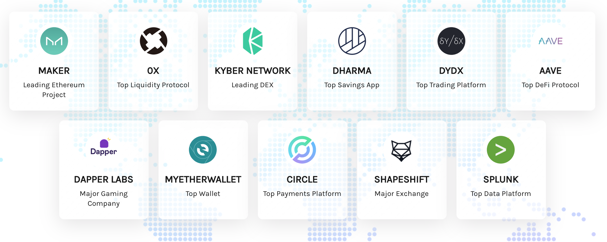

# 👋 Welcome to Alchemy

Use these docs to learn more about Alchemy's core products, explore guides, and check out our API references.

### _Get access to_ [_Alchemy for free here_](https://alchemy.com/?r=e68b2f77-7fc7-4ef7-8e9c-cdfea869b9b5)_._

## 📖 API Reference

Check out Alchemy's API Reference pages to understand how to use the [Enhanced APIs](broken-reference), a suite of higher level methods built to streamline your development workflow, and each of the chain specific endpoints for [Ethereum](apis/ethereum/), [Arbitrum](apis/arbitrum/), [Polygon](apis/polygon-api/), [Optimism](apis/optimism-api.md), [Flow](https://app.gitbook.com/o/-MB5OnTtI\_5pcZn7v2wm/s/-Mbe-myfcwH3hjIraizf/), and [Crypto.org](https://app.gitbook.com/o/-MB5OnTtI\_5pcZn7v2wm/s/-MR6M26d7HiK3wpCRH-V/)!


[Broken link](broken-reference)



[Broken link](broken-reference)


## 🤷 What is Alchemy?

Alchemy is a blockchain developer platform focused on making Ethereum development easy. We've built a suite of developer tools, enhanced APIs, and superior node infrastructure to make building and running blockchain applications seamless.

Our platform supports 70% of the top Ethereum applications, including the top blockchain companies in the world:

Our product is used by millions of users per week across 99% of all countries, bringing in of billions of dollars in annual volume.

To learn more about the benefits of using Alchemy, check out the "Why Use Alchemy?" page below.


[why-use-alchemy.md](introduction/why-use-alchemy.md)


## 🎁 Alchemy's Products and Features

Alchemy has a full suite of products built to accelerate blockchain development. Our tools make it easier for blockchain developers to focus on their applications and users, rather than interfacing with the blockchain.


[core-products](introduction/core-products/)


## 🛠 Start Building!

Get set up to use the Alchemy API in under 5 minutes. Learn how to get and use your API key, start making requests, and set up your application to use Alchemy's endpoints!


[getting-started.md](introduction/getting-started.md)

