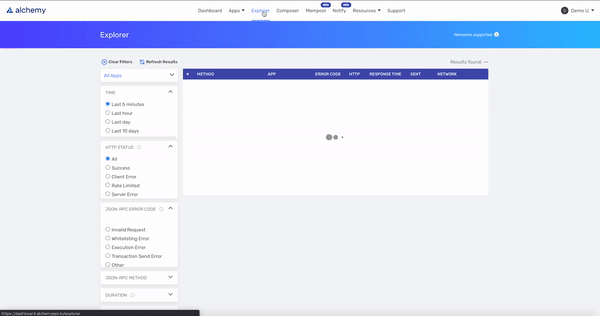
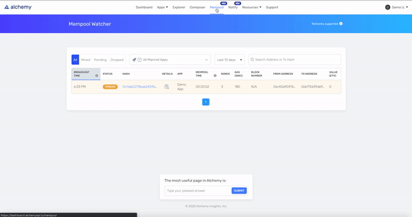

# 📋 Dashboard Walkthrough

_This guide assumes you already have an Alchemy account and access to our_ [_Dashboard_](https://dashboard.alchemyapi.io/)_._ [_**Sign up for Alchemy for free here.**_](https://alchemy.com/?r=e68b2f77-7fc7-4ef7-8e9c-cdfea869b9b5)_\*\*\*\*_

Your Demo App is a read-only example app that we created so you can explore most of our features as soon as you sign up. When you're done exploring, feel free to delete the app.


Don't worry, we've also added an extra 2K compute units for you this month, so the traffic from your Demo App won't count against you! We will automatically delete it in a week.


## 🏔 What features can I explore with my Demo App?

### 1. Demo App Stats 🎉

When you create your own app and start sending traffic, this will be a central hub for getting a high level overview of how your app is being used.

### 2. Explorer 🪐

When you want a more detailed view, come to the Explorer to get a breakdown of your requests. 


**Looking for something in particular?** Try using the filters to get a better understanding of your traffic or to pinpoint a specific bug in one of your apps.  


### 3. Mempool Watcher 👁️

When you send a transaction, you can check its status in our mempool. We've sent a transaction from your Demo App, so you can start to play around with this feature. What is the status of that transaction: mined, pending,  or dropped? 


**Don't see anything from the demo app in the mempool?** See if you can dig through the explorer to find out why \(Hint: that transaction may already be known\). **Is your transaction pending?** This can often happen if gas isn't sufficient \(Hint: gas prices could be high\)


### 4. Usage [🎢](https://emojipedia.org/roller-coaster/)

As you start to send traffic, this page will give you an idea of your [compute unit](../documentation/compute-units.md) usage. How many compute units did your Demo App use? Don't worry we've added a bonus 2K compute units to make up for this [😉](https://emojipedia.org/winking-face/#:~:text=A%20yellow%20face%20with%20a,affectionate%2C%20suggestive%2C%20or%20ironic.&text=Winking%20Face%20was%20approved%20as,to%20Emoji%201.0%20in%202015.). 

### 5. Done with your Demo App?

We hope your Demo App was helpful in getting familiar with our product! When you are done, feel free to delete it. If you don't delete it, we will automatically delete it for you in 7 days. 

_Not sure what to do next? Follow_ [_this guide_ ](../tutorials/simple-web3-script.md)_to write a simple web3 script to see how easy it is to interact with the blockchain using Alchemy._ 

