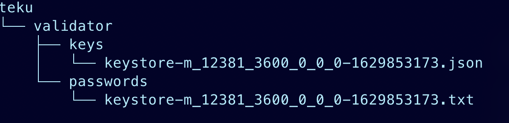

# Setting up an Eth 2.0 Staking Validator with Teku

This guide assumes you have already generated your validator keys and have submitted your initial 32 Eth to the beacon chain. If you have not done so, [please follow this guide](https://app.gitbook.com/@alchemyapi/s/alchemy/~/drafts/-Mhzhhn69TnxCLAdq3aC/guides/running-an-eth2-node-with-alchemy).

To learn more about Teku, check out their [Eth2 Documentation](https://docs.teku.consensys.net/en/latest/).


**Note**: The instructions below were adopted from the [Teku Getting Started Guide](https://docs.teku.consensys.net/en/latest/HowTo/Get-Started/Installation-Options/Run-Docker-Image/).


## Running an Eth 2.0 validator <a id="running-an-eth-2-0-validator"></a>

### 1. Install Teku  <a id="s-3-follow-the-official-eth-2-onboarding"></a>

You can find the full installation guide for Teku on the [Teku how-to page.](https://docs.teku.consensys.net/en/latest/HowTo/Get-Started/Installation-Options/Install-Binaries/)

```text
brew tap ConsenSys/teku
brew install teku
```

### 2. Run the beacon chain client  <a id="s-3-follow-the-official-eth-2-onboarding"></a>

You can run just the beacon chain and point your eth1 endpoint to the alchemy url for your app. Make sure your network matches the network that you are trying to connect to:

* Prymont -&gt; eth-goerli 
* Mainnet -&gt; eth-mainnet 

```text
teku --network=pyrmont --eth1-endpoints=<ALCHEMY API ENDPOINT HERE> \
--metrics-enabled --rest-api-enabled
```

For example:



```text
teku --network=mainnet --eth1-endpoints=https://eth-mainnet.alchemyapi.io/v2/<ALCHEMY API KEY> \
--metrics-enabled --rest-api-enabled
```



```
teku --network=pyrmont --eth1-endpoints=https://eth-goerli.alchemyapi.io/v2/<ALCHEMY API KEY> \
--metrics-enabled --rest-api-enabled
```



### 3. Run your validator <a id="s-5-run-your-validator"></a>

In a separate terminal window \(from your beacon node\), start running the validator using the command below:

Copy the full path of your keys from when you set up [your initial deposit](https://app.gitbook.com/@alchemyapi/s/alchemy/~/drafts/-Mhzhhn69TnxCLAdq3aC/guides/running-an-eth2-node-with-alchemy). In the previous guide, the path for the keys were saved in 

`/Users/dubash/Downloads/eth2deposit-cli-256ea21-darwin-amd64/validator_keys/`



```text
teku validator-client --network=mainnet --beacon-node-api-endpoint=http://192.10.10.101:5051 \
--validator-keys=eth2deposit:validator/passwords
```



```
teku validator-client --network=pyrmont --beacon-node-api-endpoint=http://192.10.10.101:5051 \
--validator-keys=validator/keys:validator/passwords
```



At this point you are up and running and ready for validator assignment!

## Running beacon chain and validator using Docker

You can run both the beacon chain and validator using docker and docker compose. [Full instructions can be found here](https://docs.teku.consensys.net/en/latest/HowTo/Get-Started/Installation-Options/Run-Docker-Image/). This will require you to have [Docker Compose](https://docs.docker.com/compose/).

### 1. Creating your docker-compose file

Create a docker compose file in the location you want to run your validator:

```text
touch docker-compose.yml
```

### 2. Copy your key 

Copy the full path of your keys from when you set up [your initial deposit](https://app.gitbook.com/@alchemyapi/s/alchemy/~/drafts/-Mhzhhn69TnxCLAdq3aC/guides/running-an-eth2-node-with-alchemy). In the previous guide, the example path for the keys were saved in:

`~/Downloads/eth2deposit-cli-256ea21-darwin-amd64/validator_keys/`as a file called `keystore-m_12381_3600_0_0_0-1629939192.json`

In this folder, you will find your keys in a `json` format. Let's make a copy of this and rename it to a `txt` format

```text
cp keystore-m_12381_3600_0_0_0-1629939192.json keystore-m_12381_3600_0_0_0-1629939192.txt
```

Now we have two files in our folder, one with a `json` extension and one with a `txt`.

We'll then create a folder called `teku` in our `validator_keys` directory. In this teku folder, we'll create a subfolder called `validator` and then create two new folders underneath validator. One called `keys` and one called `passwords`. The `.json` keys file will go in the keys folder and the `.txt` file will go into the passwords folder like below:



Finally, we'll copy the **absolute path**  of our teku folder by running:

```text
$> pwd
/Users/dubash/Downloads/eth2deposit-cli-256ea21-darwin-amd64/validator_keys/teku
```

We'll use this path in our `docker-compose` in our volumes location on line 33. In addition, we'll use our **Alchemy  endpoint as our eth1 provider** \(line25\)**.**



```text
version: '3.4'
services:
  besu_node:
    image: hyperledger/besu:latest
    command: ["--network=goerli",
              "--data-path=/opt/besu/data/data",
              "--host-allowlist=*",
              "--sync-mode=FAST",
              "--rpc-http-enabled",
              "--rpc-http-cors-origins=*",
              "--rpc-http-api=ETH,NET,CLIQUE,DEBUG,MINER,NET,PERM,ADMIN,EEA,TXPOOL,PRIV,WEB3"]
    volumes:
      - ./besu:/opt/besu/data
    ports:
      # Map the p2p port(30303) and RPC HTTP port(8545)
      - "8545:8545"
      - "30303:30303"

  teku_node:
    environment:
      - "JAVA_OPTS=-Xmx4g"
    image: consensys/teku:latest
    command: ["--network=pyrmont",
              "--data-base-path=/opt/teku/data",
              "--eth1-endpoint=https://eth-mainnet.alchemyapi.io/v2/<YOUR ALCHEMY API KEY>",
              "--validator-keys=/opt/teku/data/:/opt/teku/data/",
              "--p2p-port=9000",
              "--rest-api-enabled=true",
              "--rest-api-docs-enabled=true"]
    depends_on:
      - besu_node
    volumes:
      - /Users/dubash/Downloads/eth2deposit-cli-256ea21-darwin-amd64/validator_keys/teku:/opt/teku/data
    ports:
      # Map the p2p port(9000) and REST API port(5051)
      - "9000:9000"
      - "5051:5051"
```



```
version: '3.4'
services:
  besu_node:
    image: hyperledger/besu:latest
    command: ["--network=goerli",
              "--data-path=/opt/besu/data/data",
              "--host-allowlist=*",
              "--sync-mode=FAST",
              "--rpc-http-enabled",
              "--rpc-http-cors-origins=*",
              "--rpc-http-api=ETH,NET,CLIQUE,DEBUG,MINER,NET,PERM,ADMIN,EEA,TXPOOL,PRIV,WEB3"]
    volumes:
      - ./besu:/opt/besu/data
    ports:
      # Map the p2p port(30303) and RPC HTTP port(8545)
      - "8545:8545"
      - "30303:30303"

  teku_node:
    environment:
      - "JAVA_OPTS=-Xmx4g"
    image: consensys/teku:latest
    command: ["--network=pyrmont",
              "--data-base-path=/opt/teku/data",
              "--eth1-endpoint=https://eth-goerli.alchemyapi.io/v2/<YOUR ALCHEMY API KEY>",
              "--validator-keys=/opt/teku/data/:/opt/teku/data/",
              "--p2p-port=9000",
              "--rest-api-enabled=true",
              "--rest-api-docs-enabled=true"]
    depends_on:
      - besu_node
    volumes:
      - ~/Downloads/eth2deposit-cli-256ea21-darwin-amd64/validator_keys:/opt/teku/data
    ports:
      # Map the p2p port(9000) and REST API port(5051)
      - "9000:9000"
      - "5051:5051"

```



Finally run `docker compose up`!

## Running your validator assignment

### Be ready for your validator assignment <a id="s-6-be-ready-for-your-validator-assignment"></a>

Keep both terminal windows running so that your validator can receive tasks and execute validator responsibilities. You should already be aware of all the responsibilities and [staking logistics](https://docs.ethhub.io/ethereum-roadmap/ethereum-2.0/proof-of-stake/#staking-logistics) for being a validator.

You can check the status of your validator using block explorers: [beaconcha.in](https://beaconcha.in/) and [beacon.etherscan.io](https://beacon.etherscan.io/).

**You are now officially an Ethereum 2.0 validator, congrats!** 🎉

