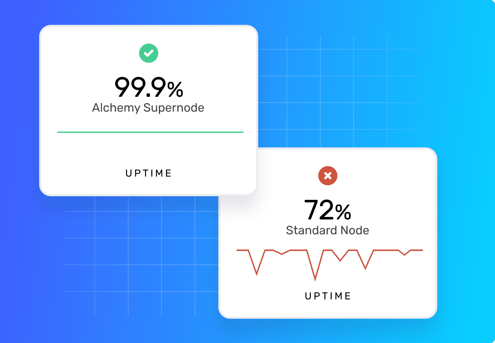

# 🦸🏻 Alchemy Supernode

_**Get access to**_ [_**Alchemy for free here**_](https://alchemy.com/?r=affiliate:e68b2f77-7fc7-4ef7-8e9c-cdfea869b9b5)_**.**_  

## Benefits

### 1. 👍 Reliability 

* Peak reliability node services
* 100% Data Correctness
* Dynamic Scalability

### 2. ⚡ Extended Capabilities 

* Instant On \(no setup or sync times\)
* Instant Testnets
* Enhanced API
* Real-time state consistency

### 3. ✔ Easy to Use 

* One-line infrastructure API
* 1,000+ engineering hours saved per year

## 😫 Problem: Nodes are hard  

The traditional Web 2.0 approach to scaling infrastructure uses multiple, indistinguishable servers managed by a load balancer, but with blockchain, applications can’t treat nodes indistinguishably because each node syncs and stores data from the blockchain asynchronously.

* Running nodes behind a load balancer may result in inconsistent data since the latest block on each node might be different
* Data inconsistencies force developers to introduce tons of complicated workarounds and lead to inevitable errors that crash applications and ruin user experience
* Apps that run directly on nodes suffer high latency and downtime because nodes are general-purpose and not designed to be highly available.
* Without a new approach to infrastructure design, developers are forced to choose between state consistency and scale.

## 😃 Solution: Alchemy Supernode

Alchemy Supernode is a new kind of infrastructure for decentralized applications with the following benefits:

* Ensures data is always correct, real-time and in sync thanks to a proprietary coordinator service
* Powers each piece of node functionality with a dedicated, distributed system -- the same systems used by Facebook and Amazon for achieving massive scale
* Scales quickly and seamlessly so you can spend more time shipping products and delighting users
* Includes enhanced API methods and upgraded WebSockets to continuously listen for changes and automatically handle reconnection and backfilling missed events
* One-line infrastructure API that not only does all the jobs of a single node, but also comes with the uptime, availability, and necessities to run a production application.

## Architecture

Alchemy Supernode's innovative architecture for web3 scales every piece of node functionality with dedicated distributed systems, and maintains real-time data correctness with a proprietary coordinator service. 

## Features 

### Data Correctness 

Eliminate unexpected crashes by ensuring data is always correct, real-time, and in sync thanks to a proprietary coordinator service.

### Peak Reliability  

Achieve best-in-class uptime, protected by highly available infrastructure, instead of suffering from high latency and downtime by using nodes directly.

### Infinite Scalability  

Scale your infrastructure quickly and seamlessly so that you can spend more time shipping products and delighting users.

### Enhanced APIs

Do more, quickly with an Alchemy Web3 extension of web3.js as well as Smart WebSockets that automatically handle reconnection and backfilling of missed events.

Check out out full suite of Enhanced APIs here:



### Instant On 

Switch to the most powerful infrastructure engine for blockchain with a single line of code. Run your app on Alchemy Supernode in 5 minutes or less.

