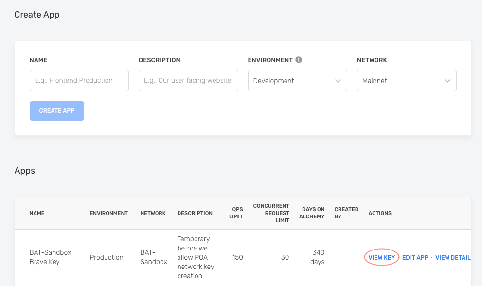

# 🚀 Getting Started

👋 _**New to Alchemy? Get access to Alchemy for free**_ [_**here**_](https://alchemy.com/?r=e68b2f77-7fc7-4ef7-8e9c-cdfea869b9b5)_**.**_

_Estimated time to complete this guide: &lt; 10 minutes ****_

## 📋 Steps to get started with Alchemy

This guide assumes you already have an [Alchemy account](https://alchemy.com/?r=e68b2f77-7fc7-4ef7-8e9c-cdfea869b9b5) and access to our [Dashboard](https://dashboard.alchemyapi.io/).  

**1**. 🔑 Create an Alchemy key 

**2**. ✍ Make a request 

**3**. 🤝 Set up Alchemy as your client

4. 💻 Start building!

## 1.🔑Create an Alchemy Key

To use Alchemy's products, you need an API key to authenticate your requests.

You can [create API keys from the dashboard](http://dashboard.alchemyapi.io). Check out this video on how to create an app:



Or follow the written steps below:

First navigate to the "create app" button in the "Apps" tab. 


Fill in the details under "Create App" to get your new key. You can also see apps you previously made and those made by your team here. Pull existing keys by clicking on "View Key" for any app.



You can also pull existing API keys by hovering over "Apps" and selecting one. You can "View Key" here, as well as "Edit App" to whitelist specific domains, see several developer tools, and view analytics.


## 2.✍Make a Request 

You can interact with Alchemy's Ethereum infrastructure provider using JSON-RPC and your [command line](https://www.computerhope.com/jargon/c/commandi.htm).

For manual requests, we recommend interacting with the `JSON-RPC` via `POST` requests. Simply pass in the `Content-Type: application/json` header and your query as the `POST` body with the following fields:

* `jsonrpc`: The JSON-RPC version—currently, only `2.0` is supported.
* `method`: The ETH API method. [See API reference.](../apis/ethereum/)
* `params`: A list of parameters to pass to the method.
* `id`: The ID of your request. Will be returned by the response so you can keep track of which request a response belongs to.

Here is an example you can run from the Terminal/Windows/LINUX command line to retrieve the current gas price:

```bash
curl https://eth-mainnet.alchemyapi.io/v2/demo \
-X POST \
-H "Content-Type: application/json" \
-d '{"jsonrpc":"2.0","method":"eth_gasPrice","params":[],"id":73}'
```


Want to send requests to your own app instead of our public demo?

Replace [https://eth-mainnet.alchemyapi.io/v2/demo](https://eth-mainnet.alchemyapi.io/jsonrpc/demo) with your own API key [https://eth-mainnet.alchemyapi.io/v2/your-api-key](https://eth-mainnet.alchemyapi.io/jsonrpc/your-api-key).


Results:

```javascript
{ "id": 73,
  "jsonrpc": "2.0",
  "result": "0x09184e72a000" // 10000000000000 }
```

## 3.🤝Set up Alchemy as your Client  

Below you will find how to set up or switch your current provider to Alchemy for Alchemy Web3, Web3.js, Web3.py, Web3j, and Ether.js. .  


**If you have an existing client,** change your current node provider URL to an Alchemy URL with your API key: "https://eth-mainnet.alchemyapi.io/v2/your-api-key"

**Note:** The scripts below need to be run in a **node context** or **saved in a file**, not run from the command line. 


### Alchemy Web3

There are tons of Web3 libraries you can integrate with Alchemy, however, we recommend using [Alchemy Web3](../documentation/alchemy-web3/), a drop-in replacement for web3.js, built and configured to work seamlessly with Alchemy. This provides multiple advantages such as automatic retries and robust WebSocket support.

To install AlchemyWeb3.js, navigate to your project directory and run:

With Yarn:

```text
yarn add @alch/alchemy-web3
```

With NPM:

```text
npm install @alch/alchemy-web3
```

To interact with Alchemy's node infrastructure, run in NodeJS or add this to a JavaScript file:

```javascript
const { createAlchemyWeb3 } = require("@alch/alchemy-web3");
const web3 = createAlchemyWeb3("https://eth-mainnet.alchemyapi.io/v2/your-api-key");
```


For a more detailed explanation of import functions in JavaScript, [read this](https://gist.github.com/dphilipson/77872c24350a2e1b591917ae746d3438)!


### Other Web3 Libraries 

To use the any of the libraries below, you will need to install web3 first with `npm install web3` . Once you've installed web3, add any one of the below code snippets to a new JavaScript, Python, or Java file \(depending on which library you choose\). 

#### Web3.js 

See the [official documentation](https://web3js.readthedocs.io/en/v1.2.9/) for quick start guides and more information.

```javascript
// JavaScript: web3.js
const Web3 = require('web3');
const web3 = new Web3("https://eth-mainnet.alchemyapi.io/v2/your-api-key");
```

#### Web3.py

See the [official documentation](https://web3py.readthedocs.io/en/stable/) for quick start guides and more information.

```python
# Python: web3.py
web3 = Web3(Web3.HTTPProvider("https://eth-mainnet.alchemyapi.io/v2/your-api-key"));
```

#### Web3j

See the [official documentation](https://docs.web3j.io/) for quick start guides and more information.

```java
// Java: web3j
Web3j web3 = Web3j.build(new HttpService("https://eth-mainnet.alchemyapi.io/v2/your-api-key"));
```

### Ethers.js 

See the [official documentation](https://docs.ethers.io/v5/) for quick start guides and more information.

```javascript
// Ethers.js
const url = "https://eth-mainnet.alchemyapi.io/v2/your-api-key";
const customHttpProvider = new ethers.providers.JsonRpcProvider(url);
```

## 4. 💻 Start Building! 

Don't know where to start? Check out these four tutorials to get more familiar with Alchemy and blockchain development:

1. Test out your dashboard knowledge with the [Dashboard Demo App](../guides/demo-app.md)
2. Write a [simple web3 script](../tutorials/simple-web3-script.md) that gets the latest block number
3. Learn how to send an [Ethereum transaction](../tutorials/sending-txs.md) using Web3 and Alchemy
4. Try deploying your first [smart contract ](../tutorials/hello-world-smart-contract/)and get your hands dirty with some solidity programming


