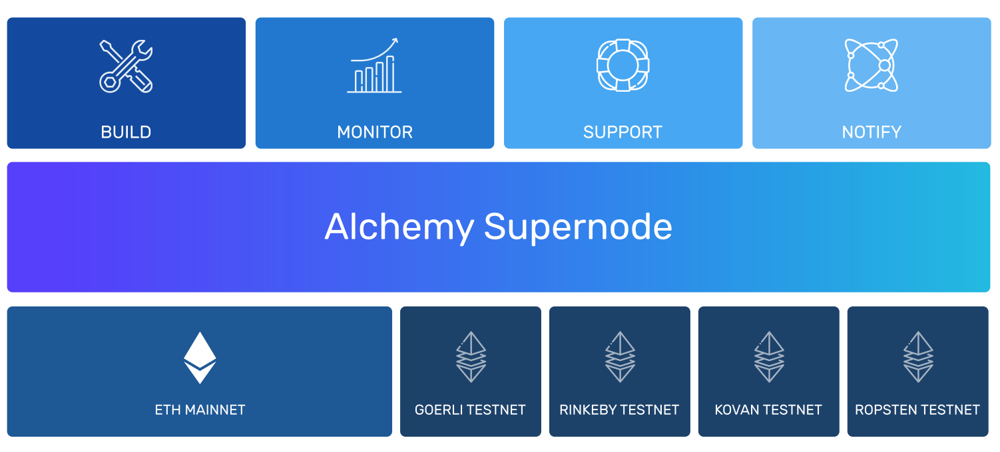

# 🤔 Why Use Alchemy?

#### _**Get access to **_[_**Alchemy for free here**_](https://alchemy.com/?r=e68b2f77-7fc7-4ef7-8e9c-cdfea869b9b5)_**. **_

## ****:mega: Calling all Ethereum developers...

Whether you are using Ethereum for the first time, working on a solo project, or working for the largest teams in the space, Alchemy is here to make your life as an Ethereum developer exponentially better.

## :calling: Want to build a dApp? You're going to need nodes...

With the current blockchain landscape, maintaining self-hosted nodes is expensive, unreliable, and extremely time-consuming. Alchemy gives you access to our custom [Supernode](core-products/alchemy-supernode.md) API that is built for production, requires only 1-minute to integrate, and has 100% data correctness. We also provide an additional suite of developer tools to make your life as a blockchain developer even easier.

## :thumbsdown: The Downside of Self-Hosted Nodes

Running and maintaining self-hosted nodes can be a blockchain developer's #1 pain.&#x20;

#### It's expensive:

* An average of $86k/year in costs
* $2k-5k/month in AWS costs
* $4800/month of engineering time

#### It's time consuming:

* Teams waste 25% of engineering resources managing nodes
* It takes 3-6 months to develop robust infrastructure
* Failures can be catastrophic, requiring up to 3 weeks to recover

#### It can be unreliable:

* Nodes on average have issues once every 5 days:
  * CPU spikes, memory leaks, disk issues&#x20;
  * Inconsistent peering&#x20;
  * Corrupted internal databases&#x20;
  * Transaction broadcasting issues&#x20;
  * Frequent bugs + regressions
  * 1 in 6 “stable releases” are broken&#x20;

Trust us, you don't want to be doing this.&#x20;

## :sunglasses: Leave Node Hosting to the Experts

Alchemy's core products are here to eliminate the pains of self-hosting nodes, in addition to providing world-class developer tools.&#x20;

### [Alchemy Supernode](core-products/alchemy-supernode.md)

Alchemy Supernode is our infrastructure engine that replaces the typical self-hosted blockchain node, with unparalleled advantages:&#x20;

* [x] 1,000+ engineering hours saved per year
* [x] 99.9% Reliability
* [x] Dynamic Scalability: as you scale, we scale&#x20;
* [x] 100% Data Correctness
* [x] Instant On (no setup or sync times)
* [x] Instant Testnet
* [x] Enhanced APIs

**Learn more about Alchemy Supernode **[**here**](core-products/alchemy-supernode.md)**. **

### ****[Alchemy Build](core-products/alchemy-build.md)

Alchemy Build is our powerful suite of developer tools to help you spend less time debugging, and more time creating:

* [x] 25% faster product development
* [x] Composer: test out API calls in real-time
* [x] Explorer: search through historical requests to debug and optimize
* [x] Mempool Visualizer: see the real-time state of transactions in the mempool
* [x] Real Time Query Visualizer

**Learn more about Alchemy Build **[**here**](core-products/alchemy-build.md)**. **

### [Alchemy Monitor ](core-products/alchemy-monitor.md)

Alchemy Monitor is a monitoring tool to provide you with the data necessary to understand health and growth of your app:

* [x] 5 hours less per issue on average
* [x] Application monitoring and alerts
* [x] Dashboard with App details
* [x] Geographic visualization: know where your users are located
* [x] Usage measurement: understand how your app is being used

**Learn more about Alchemy Monitor **[**here**](core-products/alchemy-monitor.md)**. **

### [Alchemy Notify ](core-products/alchemy-notify.md)

Alchemy Notify provides timely notifications on the most important Web3 events.

* [x] Improved UX, Engagement and Retention
* [x] Transactions Mined
* [x] Transactions Dropped
* [x] Two-Click Process

**Learn more about Alchemy Notify **[**here**](core-products/alchemy-notify.md)**. **

### [Alchemy Support](../resources/contact-us.md)&#x20;

Alchemy has expert, hands-on support, dedicated for all customers.

* [x] 98% Customer Satisfaction (CSAT) Score
* [x] Direct access to core engineers
* [x] Advising on building product
* [x] Connections to other people in industry

**Learn more about Alchemy Support **[**here**](../resources/contact-us.md)**. **

## :handshake: Who we work with

Top blockchain companies and millions of users around the world trust our products. &#x20;

* 4 million users per week across 197 countries
* 70% of top Ethereum applications
* 10s of Billions of Dollars in yearly volume
* $1 Billion+ DeFi assets (74% of all value)&#x20;

### User Quotes&#x20;

> **"Alchemy is extremely reliable and robust, and sets the standard for how blockchain infrastructure should be. Alchemy just works. Very rarely does a company come along that takes 30 seconds to integrate with and saves you substantial time and money." - Joey Krug, CIO Plantera **

> "Using your own node or an error-prone service means wasting hundreds of valuable engineering hours on problems that have nothing to do with your company. Nothing else compares to Alchemy's amazing level of reliability, speed, support." - Alex Atallah, CTO OpeanSea

> **"Using Alchemy is a no-brainer for us. In DeFi, where markets are 24/7, low-latency and high-uptime are especially important, and Alchemy provides just that." - Brandon Millman, Engineering Manager 0x**

> "Since using Alchemy, our team has been able to refocus its time on building new product features for Augur that we wouldn’t have been able to otherwise. We used to spend a notable amount of time dealing with infrastructure issues, and now we don’t worry at all." - Tom Kysar, Augur

> **"We ran our own Ethereum infrastructure for long enough, partnering with Alchemy to instead focus on building our business. Now we leave Ethereum infrastructure to the pros." - Adam Link, Engineer, Airswap**

## ****:star\_struck: Sounds Good?

[Sign up for free here](https://dashboard.alchemyapi.io/signup/). [Get started here](getting-started.md).&#x20;
