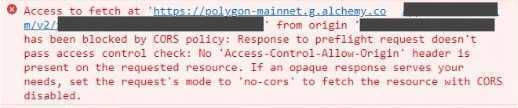

# 🪲Debugging CORS problems for end-users

## Overview

CORS issues happen when the browser does not trust the endpoint that it is trying to reach. In order to allow calls from the browser to the Alchemy endpoint to succeed, we include specific CORS headers in our API response. The problem described here occurs when something about the user's internet, browser, extensions, installed applications, etc hinders the proper interpretation of those headers.

## Examples

Here are some samples of what a CORS problem might look like for your users. Always encourage them to send screenshots or copy-paste snippets of their browser console.

## Some causes and fixes

As mentioned above, any hindrance in the request lifecycle before reaching Alchemy servers can cause this problem. Here are a few of the root causes we have identified in the past and how to resolve them:

### The user has an antivirus such as Bitdefender installed

[Bitdefender](https://www.bitdefender.com/) \(and other antivirus softwares\) can be installed on the OS or as a browser extension. There are multiple ways that an endpoint can be blocked by an antivirus:

* The endpoint may be categorized under "banking", which might have additional restrictions configured in the antivirus settings.
* The user may have parental controls restricting their web access.
* The endpoint may be on a global blacklist \(unlikely\).

In each of these cases the resolution is to add the blocked endpoint to the exceptions list, or whitelist of the antivirus. The user may need to add multiple endpoints and potentially a wildcard for the entire https://alchemy.com and https://alchemyapi.io domains.

### The user's ISP or router is blocking the website

Sometimes an ISP or router will block a site based on DNS. First ask the user to navigate directly directly to [https://www.alchemy.com/](https://www.alchemy.com/) and [https://www.alchemyapi.io](https://www.alchemy.com/). If they are unable to access the websites then they might be getting DNS blocked. To confirm this is the case, switch the user to a VPN and see if they can access the websites and if the CORS issue persists. A longer term resolution is to recommend an open DNS provider.

### Your application uses a browser extension \(unlikely\)

Google Chrome released [an update](https://www.chromium.org/Home/chromium-security/extension-content-script-fetches) in September 2020 that makes it much more difficult for Chrome extensions to make cross-domain requests. If your application depends on a Chrome extension then this could be the problem.

## Submitting a persistent problem

If none of the causes and fixes above are helping then please loop us in! You can reach out to us on [discord](https://discord.com/invite/mMGsVgd) anytime and we will get an engineer to help. Some information that will be useful to gather beforehand:

* User's computer manufacturer.
* Operating system and version.
* What browser they are using and version of that browser.
* Antivirus softwares installed, if any.
* If the user navigates directly to [https://www.alchemy.com/](https://www.alchemy.com/) or [https://www.alchemyapi.io](https://www.alchemyapi.io) do are they able to view the website?
* What country is the user located in?
* What mitigations the user may have tried so far.
  * Using a different browser.
  * Using a different computer.
  * Using a different internet connection.
  * Clearing the browser cache.
  * Restarting the computer.

This information is not required, but it will help us get a better handle on the issue.

