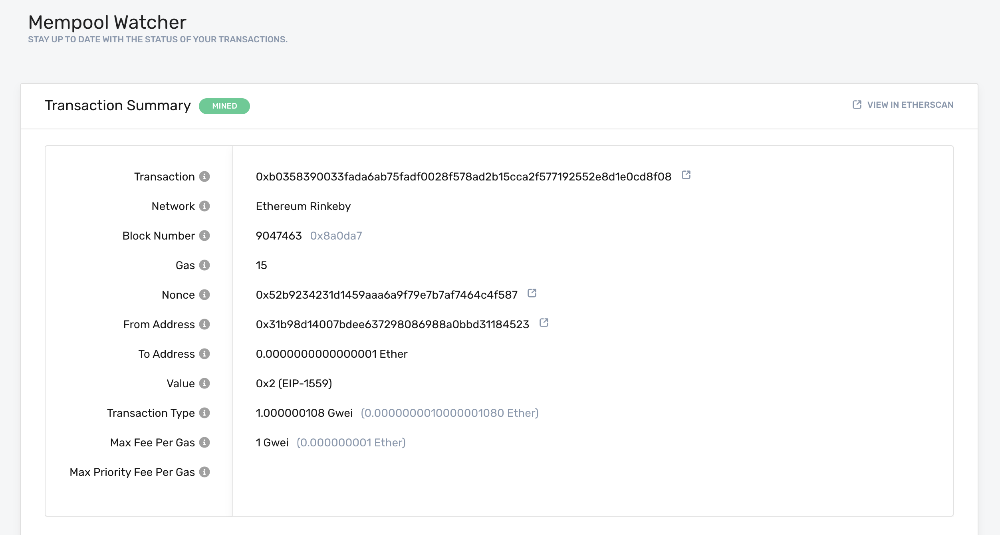

# 💸 Sending Transactions Using Web3

There are three main steps in order to send a transaction to the Ethereum blockchain: create, sign, and broadcast. We'll go through all three, hopefully answering any questions you might have!  In this tutorial, we'll be using [Alchemy](https://dashboard.alchemyapi.io/signup?referral=affiliate:9efcc9a2-ef89-4a2b-a5f3-1dd52ad32c4c) to send our transactions to the Ethereum chain. You can [create a free Alchemy account here.](https://alchemy.com/?r=affiliate:9efcc9a2-ef89-4a2b-a5f3-1dd52ad32c4c)


**NOTE: **This guide is for signing your transactions on the _backend_ for your app, if you want to integrate signing your transactions on the frontend, you'll need to integrate a [browser provider with Web3](../documentation/alchemy-web3/#with-a-browser-provider).&#x20;


## The Basics&#x20;

Like most blockchain developers when they first start, you might have done some research on how to send a transaction (something that should be pretty simple) and ran into a plethora of guides, each saying different things and leaving you a bit overwhelmed and confused. If you're in that boat, don't worry; we all were at some point! So, before we start, let's get a few things straight:

### **1. Alchemy does not store your private keys **

* This means that Alchemy cannot sign and send transactions on your behalf. The reason for this is security purposes. Alchemy will never ask you to share your private key, and you should never share your private key with a hosted node (or anyone for that matter).
* You can read from the blockchain using Alchemy's core API, but to write to it you'll need to use something to sign your transactions before sending them through Alchemy.&#x20;

### **2. What is a "signer"?**

* Signers will sign transactions for you using your private key. In this tutorial we'll be using alchemy web3 to sign our transaction, but you could also use any other web3 library.&#x20;
* In the frontend, a good example of a signer would be [metamask](https://metamask.io), which will sign and send transactions on your behalf.&#x20;

### **3. Why do I need to sign my transactions?**

* Every user that wants to send a transaction on the Ethereum network must sign the transaction first in order to validate that the origin of the transaction is who it claims to be.
* It is super important to protect this private key, since having access to it grants full control over your Ethereum account, allowing you (or anyone with access) to perform transactions on your behalf.

### **4. How do I protect my private key?**

* There are many ways to protect your private key and to use it to send off transactions. In this tutorial we will be using a .env file. However, you could also use a separate provider that stores private keys, use a keystore file, or other options.

### **5. What is the difference between `eth_sendTransaction` and `eth_sendRawTransaction`?**

`eth_sendTransaction` and `eth_sendRawTransaction` are both Ethereum API functions which broadcast a transaction to the Ethereum network so it will be added to a future block. They differ in how they handle signing of the transactions.

* [`eth_sendTransaction`](https://web3js.readthedocs.io/en/v1.2.0/web3-eth.html#eth-sendtransaction) is used for sending _unsigned_ transactions, which means the node you are sending to must manage your private key so it can sign the transaction before broadcasting it to the chain. Since Alchemy doesn't hold user's private keys, we do not support this method.
* [`eth_sendRawTransaction`](https://docs.alchemyapi.io/documentation/alchemy-api-reference/json-rpc#eth\_sendrawtransaction) is used to broadcast transactions that have already been signed. This means you first have to use[`signTransaction(tx, private_key)`](https://web3js.readthedocs.io/en/v1.2.0/web3-eth.html#signtransaction), then pass in the result into `eth_sendRawTransaction`.

When using web3, `eth_sendRawTransaction` is accessed by calling the function [web3.eth.sendSignedTransaction](https://web3js.readthedocs.io/en/v1.2.0/web3-eth.html#sendsignedtransaction). This is what we will be using in our tutorial.

### 6. What is the web3 library?

* Web3 is a wrapper library around the standard JSON-RPC calls that is quite common to use in Ethereum development.
* There are many different web3 libraries for different languages. In this tutorial we'll be using Alchemy web3 which is written in JavaScript. You can check out other options [here](../introduction/getting-started.md#other-web3-libraries).&#x20;

Okay, now that we have a few of these questions out of the way, let's move on to the tutorial. Feel free to ask questions anytime in our [discord](https://discord.gg/sqYmQ7fB)!&#x20;


**NOTE: **This guide assumes you have an Alchemy account, an Ethereum address or Metamask wallet, NodeJs, and npm installed. If not, follow these steps:

1. ****[**Create a free Alchemy account **](https://dashboard.alchemyapi.io/signup?referral=affiliate:9efcc9a2-ef89-4a2b-a5f3-1dd52ad32c4c)****
2. ****[**Create Metamask account**](https://metamask.io)** (or get an Ethereum account) **
3. ****[**Follow these steps to install NodeJs and NPM**](../guides/alchemy-for-macs.md#1-install-nodejs-and-npm)****


## Steps to Sending your Transaction

### 1. Create an Alchemy app on the Rinkeby testnet

Navigate to your [Alchemy Dashboard](https://dashboard.alchemyapi.io) and create a new app, choosing Rinkeby for your network. (In practice, you could use any testnet of your choice, but for this guide we're sticking to Rinkeby.)

### 2. Request Eth from the [Rinkeby faucet](https://faucet.rinkeby.io)

Follow the instructions on the faucet homepage to receive Eth. You will have to share your public address on social media for this specific faucet.  Make sure to include your **Rinkeby** Ethereum address (from Metamask) and not another network. After following the instructions, double check that you've received the Eth in your wallet.&#x20;

### 3. Create a new project directory and `cd` into it

Create a new project directory from the [command line ](https://www.computerhope.com/jargon/c/commandi.htm)(terminal for macs) and navigate into it:

```bash
mkdir sendtx-example
cd sendtx-example
```

### 4. Install [Alchemy Web3](../documentation/alchemy-web3/) (or any web3 library)&#x20;

Run the following command in your project directory:

```bash
npm install @alch/alchemy-web3
```

### 5. Install dotenv&#x20;

We'll use a .env file to safely store our API key and private key.


We make a .env file to securely store private environmental variables in our local machine that we may access from other files (some of which we can make public).

If you want to check out how `dotenv` actually works in the context of a conventional NodeJS server file, check out this helpful [video](https://www.youtube.com/watch?v=5WFyhsnU4Ik)!


```bash
npm install dotenv --save
```

### 6. Create the .env file &#x20;

Create a .env file (make sure the file is literally just named `.env`, nothing more) in your project directory and add the following (replacing `your-api-key` and `your-private-key`, keeping both within the quotation marks):

* To find your Alchemy API URL, navigate to the app details page of the app you just created on your dashboard, click "View Key" in the top right corner, and grab the HTTP URL.&#x20;
* To find your private key using Metamask, check out this [guide](https://metamask.zendesk.com/hc/en-us/articles/360015289632-How-to-Export-an-Account-Private-Key).

```bash
API_URL = "https://eth-rinkeby.alchemyapi.io/v2/your-api-key"
PRIVATE_KEY = "your-private-key"
```

### 7. Create `sendTx.js` file

Great, now that we have our sensitive data protected in a .env file, let's start coding. For our send transaction example, we'll be sending Eth back to the Rinkeby faucet.&#x20;

Create a `sendTx.js` file, which is where we will configure and send our example transaction, and add the following lines of code to it:

```javascript
async function main() {
    require('dotenv').config();
    const { API_URL, PRIVATE_KEY } = process.env;
    const { createAlchemyWeb3 } = require("@alch/alchemy-web3");
    const web3 = createAlchemyWeb3(API_URL);
    const myAddress = '0x610Ae88399fc1687FA7530Aac28eC2539c7d6d63' //TODO: replace this address with your own public address
   
    const nonce = await web3.eth.getTransactionCount(myAddress, 'latest'); // nonce starts counting from 0

    const transaction = {
     'to': '0x31B98D14007bDEe637298086988A0bBd31184523', // faucet address to return eth
     'value': 100,
     'gas': 30000,
     'maxPriorityFeePerGas': 1000000108,
     'nonce': nonce,
     // optional data field to send message or execute smart contract
    };
   
    const signedTx = await web3.eth.accounts.signTransaction(transaction, PRIVATE_KEY);
    
    web3.eth.sendSignedTransaction(signedTx.rawTransaction, function(error, hash) {
    if (!error) {
      console.log("🎉 The hash of your transaction is: ", hash, "\n Check Alchemy's Mempool to view the status of your transaction!");
    } else {
      console.log("❗Something went wrong while submitting your transaction:", error)
    }
   });
}

main();
```

Be sure to replace the address on line 6 with your own public address.

Now, before we jump into running this code, let's talk about some of the components here.&#x20;

* `nonce` : The nonce specification is used to keep track of the number of transactions sent from your address. We need this for security purposes and to prevent [replay attacks](../resources/blockchain-glossary.md#account-nonce). To get the number of transactions sent from your address we use [getTransactionCount](../apis/ethereum/#eth\_gettransactioncount).&#x20;
* `transaction`: The transaction object has a few aspects we need to specify&#x20;
  * `to`: This is the address we want to send Eth to. In this case, we are sending Eth back to the [Rinkeby faucet](https://faucet.rinkeby.io) we initially requested from.&#x20;
  * `value`: This is the amount we wish to send, specified in wei where 10^18 wei = 1 ETH
  * `gas`: There are many ways to determine the right amount of gas to include with your transaction. Alchemy even has a [gas price webhook](../guides/using-notify.md#address-activity-1) to notify you when the gas price falls within a certain threshold. For mainnet transactions, it's good practice to check a gas estimator like [Eth Gas Station](https://ethgasstation.info) to determine the right amount of gas to include. 21000 is the minimum amount of gas an operation on Ethereum will use, so to ensure our transaction will be executed we put 30000 here.
  * `maxFeePerGas`: This is the amount you are willing to pay per gas for the transaction to execute. Since EIP 1559, this field or the `maxPriorityFeePerGas` field is required.
  * `nonce`: see above nonce definition. Nonce starts counting from zero.&#x20;
  * \[OPTIONAL] `data`: Used for sending additional information with your transfer, or calling a smart contract, not required for balance transfers, check out the note below.&#x20;
* `signedTx`: To sign our transaction object we will use the `signTransaction` method with our `PRIVATE_KEY`
* `sendSignedTransaction`: Once we have a signed transaction, we can send it off to be included in a subsequent block by using `sendSignedTransaction`


**A Note on `data`**

There are a two main types of transactions that can be sent in Ethereum.

* **Balance transfer: **Send eth from one address to another. No `data` field required, however, if you'd like to send additional information alongside your transaction, you can include that information in HEX format in this field.&#x20;
  * For example, let's say we wanted to write the hash of an IPFS document to the ethereum chain in order to give it an immutable timestamp. Our data field should then look like `data: web3.utils.toHex(‘IPFS hash‘)`. And now anyone can query the chain and see when that document was added.&#x20;
* **Smart contact transaction: **Execute some smart contract code on the chain. In this case, the `data` field should contain  the smart function you wish to execute, alongside any parameters.&#x20;
  * For a practical example, check out Step 8 in this [Hello World Tutorial](hello-world-smart-contract/#step-8-create-the-transaction).


### 8. Run the code using `node sendTx.js`

Navigate back to your terminal or command line and run:

```javascript
node sendTx.js
```

### 9. See your transaction in the Mempool&#x20;

Open up the [Mempool page](https://dashboard.alchemyapi.io/mempool) in your Alchemy dashboard and filter by the app you created to find your transaction. This is where we can watch our transaction transition from pending state to mined state (if successful) or dropped state if unsuccessful. Make sure to keep it on "All" so that you capture "mined", "pending", and "dropped" transactions.  You can also search for your transaction by looking for transactions sent to address `0x31b98d14007bdee637298086988a0bbd31184523`

To view the details of your transaction once you've found it, select the tx hash, which should take you to a view that looks like this:



From there you can view your transaction on Etherscan by clicking on the icon circled in red!

### Yippieeee! You just sent your first Ethereum transaction using Alchemy 🎉

Once you complete this tutorial, let us know how your experience was or if you have any feedback by tagging us on Twitter [@alchemyplatform](https://twitter.com/AlchemyPlatform)!

_For feedback and suggestions about this guide, please message Elan on Alchemy's _[_Discord_](https://discord.gg/A39JVCM)_! _

_Not sure what to do next? As a final test of your skills, get your hands dirty with some solidity programming by implementing our _[_Hello World Smart Contract_](hello-world-smart-contract/)_ tutorial. _
