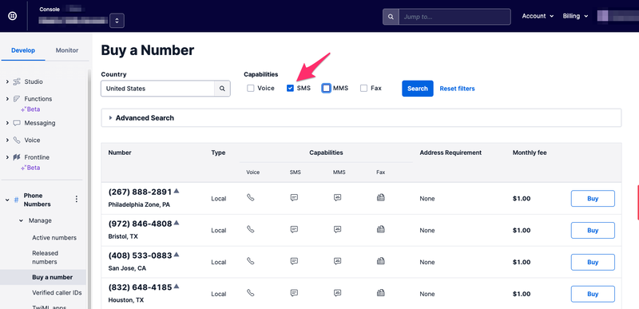
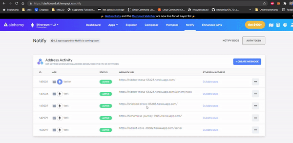

# ♻️ Alchemy Notify Tutorial: Tracking Transaction Life Cycles

While dApps on Ethereum have become incredibly complex, one of the largest pain points for Ethereum users is the lack of transparency and clarity surrounding a transaction's life cycle.  Oftentimes, dApp users are left with uncertainty surrounding pending transactions, forcing them to constantly refresh block explorers or their wallet dashboards to check if their transactions have been confirmed/mined. 

For dApps, simple notifications that track transaction life cycles provide a valuable user experience that allows for higher customer engagement.  In particular, they can help alleviate the stress involved in pending transactions as Ethereum's ever-increasing gas fees force users to set lower `maxPriorityFeePerGas` to save money and inadvertently increase wait times.  

While building reliable transaction trackers has traditionally been complicated and unreliable, [Alchemy Notify](https://www.alchemy.com/notify) and [Alchemy's pending transaction WebSocket](https://docs.alchemy.com/alchemy/guides/using-websockets#2-alchemy_filterednewfullpendingtransactions) allows us to monitor and send sending real-time push notifications regarding tx life cycles.  

In this tutorial, we’ll look at an example of how, with just a few lines of code, your dApp can integrate the power of Alchemy's Enhanced API suite, leveraging multiple Alchemy products to build a single feature to enhance user experience.

### **Overview**

1. [High-level walkthrough of the example project](tracking-transaction-life-cycles.md#our-example)
2. [Build the project using Heroku](tracking-transaction-life-cycles.md#option-1-build-heroku-serviced-project)
   1. [Clone Github Repo, Set-Up Heroku, Set-Up Twilio](tracking-transaction-life-cycles.md#1-set-up-github-repo-and-heroku) 
   2. [Alchemy Notify API & Register Webhook Notifications](tracking-transaction-life-cycles.md#2-alchemy-notify-api-and-register-webhook-notifications)
      * Create a [free Alchemy account](https://alchemy.com/?r=affiliate:ba2189be-b27d-4ce9-9d52-78ce131fdc2d)
   3. \*\*\*\*[ ****alchemy\_filteredNewFullPendingTransactions](tracking-transaction-life-cycles.md#3-alchemy_filterednewfullpendingtransactions)
   4. [Configure SMS notifications](tracking-transaction-life-cycles.md#4-configure-sms-notifications)
   5. [Deploy Heroku App!](tracking-transaction-life-cycles.md#5-deploy-heroku-app)
3. [Build the project from scratch](tracking-transaction-life-cycles.md#option-2-build-the-webapp-from-scratch)
   1. [Set-Up Heroku, Set-Up Twilio ](tracking-transaction-life-cycles.md#1-2-complete-steps-1-2-from-the-heroku-project)
   2. [Alchemy Notify API & Register Webhook Notifications](tracking-transaction-life-cycles.md#1-2-complete-steps-1-2-from-the-heroku-project)
      * Create a [free Alchemy account](https://alchemy.com/?r=affiliate:ba2189be-b27d-4ce9-9d52-78ce131fdc2d)
   3. [Create WebSocket connection](tracking-transaction-life-cycles.md#3-create-websocket-connection)
   4. [Create Webhook connection](tracking-transaction-life-cycles.md#4-create-webhook-connection)
   5. [Deploy!](tracking-transaction-life-cycles.md#5-deploy-heroku-app-1)
4. [Conclusion](tracking-transaction-life-cycles.md#conclusion)

### **Our Example**

For this example, we’ll be creating a notification system that automatically detects a user's address activity and sends an SMS text whenever a pending transaction has been made from their address, along with a follow-up text once that transaction has been mined. This allows users to have peace of mind when transferring ETH or making a DeFi transaction, allowing them to step away from their computer screen and still receive updates on the life cycle of their transactions. For our architecture, we’ll use a [WebSocket](https://docs.alchemy.com/alchemy/guides/using-websockets) script to detect pending transactions and a WebHook in conjunction with Alchemy Notify to monitor mined transactions.  


**NOTE:** If you don't want to spend real \(mainnet\) Ethereum for test notifications in this tutorial, you can use any Ethereum testnet, like Rinkeby, so that you can make transactions without paying for gas ⛽!   
  
For access to free Rinkeby, use this [dev faucet](https://faucet.rinkeby.io/).


Our tutorial specifically leverages two different Alchemy products to give a holistic picture of a transaction's inception and its completion.  

#### "Pending transaction" notification workflow:

1. User initiates a transaction on MetaMask, through Alchemy, or any other RPC
2. Pending transaction is picked up by Alchemy
3. WebSocket script receives pending transaction
4. Script sends SMS notification

#### "Mined transaction" notification workflow:

1. A pending transaction initiated by the user has been made and is confirmed by a miner
2. Alchemy Notify API picks up the mined transaction 
3. WebHook endpoint is notified of the transaction 
4. Webapp sends SMS notification

**We’ll go through two versions of the tutorial: the first by cloning the Github Repo using Heroku and the second by doing it all from scratch.** 

## **Option 1: Build Heroku-Serviced Project**

### 1. Set Up Github Repo & Heroku 

#### a\) Make a clone of the existing [Github Repository](https://github.com/alchemyplatform/Transaction-Lifecycle-via-SMS)

Navigate to your command line and type:

```text
git clone https://github.com/alchemyplatform/Transaction-Lifecycle-via-SMS.git

cd Transaction-Lifecycle-via-SMS
```

#### b\) Install Heroku-CLI and verify/install dependencies

In this tutorial, we utilize Heroku for hosting a server and website; if you choose to use Heroku, be sure to follow all of the following steps. If you want to use another provider, see [Option 2: Build Project From Scratch](tracking-transaction-life-cycles.md#option-2-build-the-webapp-from-scratch)

* Download [Heroku-CLI](https://devcenter.heroku.com/articles/heroku-cli#download-and-install) based on your OS.  Make sure you download the correct version based on what kind of computer environment you are using!


* After installation, navigate into the file that you just git cloned and run the following command in your command line to login to your Heroku account.

```text
heroku login
```

Follow the commands to login into your Heroku account. If you don't have a Heroku account, you can [sign up for one](https://www.heroku.com/) for free!   


* Let's confirm that you have downloaded the correct version of Node. In your command line run: 

```text
node --version
```

After running the command, you will either see a version number appear or you will instead get an error message telling you that you do not have Node installed.  


Note that Heroku requires users to have any version of Node greater than 10 installed. If you don’t have it or have an older version, [install a more recent version of Node](https://nodejs.org/en/download/). 

* Lastly, let's confirm that we also have npm installed properly. 

Again in your command line, run the following command:

```text
npm --version
```

npm is installed with Node, so check that it’s there. If you don’t have it, [install a more recent version of Node](https://nodejs.org/en/download/)**.**

#### c\) Initiate Heroku

Now that we have confirmed that Heroku has all the dependencies it needs to run, let's create our Heroku app by running the following command:

```text
heroku create
```

You should then see something like this pop up:


Make sure you take note of the URL that pops up **`http://xxxxxxxxx.herokuapp.com/`.** We'll be using it since it's the URL of our sample dashboard!


**NOTE:** For more detailed instructions on setting up your environment to be configured for Heroku, check out the [official Heroku docs](https://devcenter.heroku.com/articles/getting-started-with-nodejs?singlepage=true).


#### **d**\) Create a Twilio account

Twilio is an online SMS and voice provider that allows users to send text messages via the Internet.  We use Twilio here but there are also other providers that provide similar services. 

 If you are new to Twilio, sign up for a[ trial account](https://www.twilio.com/try-twilio). With your trial account, you'll have enough credits to power your SMS notifications!  Once you've signed up, head over to your [Console](https://www.twilio.com/console) and grab your Account SID and your Auth Token. You'll need both of these to use the Twilio API.


Once you have a Twilio account,  note that sending messages through Twilio requires a Twilio phone number with SMS capabilities. If you don’t currently own a Twilio phone number with SMS capabilities, you’ll need to buy one with your provided credits. After navigating to the [Buy a Number page](https://www.twilio.com/console/phone-numbers/search), check the 'SMS' box and click 'Search' to find/buy a number that works for you!



Keep track of your Twilio Account SID, Auth Token, and phone number.  It will come in handy soon!

### **2. Alchemy Notify API & Register Webhook Notifications**

First, let’s look at how notifications with Alchemy work. There are two ways to create and modify notifications: through the [Alchemy Notify dashboard](https://dashboard.alchemyapi.io/notify), and through the [Alchemy Notify API](https://docs.alchemy.com/alchemy/documentation/apis/enhanced-apis/notify-api). For our example, we’ll only be using the dashboard.  


**NOTE:** If you don’t already have one, you’ll first need to [create an account on Alchemy](https://alchemy.com/?r=affiliate:ba2189be-b27d-4ce9-9d52-78ce131fdc2d). The free version will work fine for getting started. 


Once you have an account, go to the dashboard and select “Notify” from the top menu. Here you’ll see the different kinds of notifications you can set up:

* Address Activity
* Dropped Transactions
* Mined Transaction
* Gas Price


For our example, we’ll use the [Address Activity](https://docs.alchemy.com/alchemy/guides/using-notify#address-activity) notification, but you should be able to easily swap out any of the others for your own use case.  


**NOTE:** We use "Address Activity" and not "Mined Transaction Notifications" in this example since the "Mined Transaction" webhook only picks up on mined transactions made through the Alchemy API.  "Address Activity" allows us to read all transactions via a user-defined address as long as it is posted onto the Ethereum blockchain.


In the dashboard, you can create all of your notifications, add the addresses you want to monitor, and add the webhook URL that Alchemy should communicate with when that notification triggers. Alchemy sends all the relevant details to this webhook. Your server needs to simply create the webhook, receive the call, and process the information as needed. 



#### **a\) Create our example notification by clicking “Create Webhook” on Address Activity.**


#### **b\) Enter our webhook URL** 

* If using Heroku, see Step 1 for the http://xxxxxxxxx.herokuapp.com/ URL that was generated with `heroku create`
* If doing from scratch, insert your custom webhook URL from whichever service provider you are using.  

#### **c\) Enter an Ethereum address that you want to monitor**

While this tutorial is designed to monitor pending/mined transactions of a user's own wallet, this example can be easily adapted to monitor other addresses of interest!

#### **d\) Select an app from the dropdown menu** 

Make sure the app selected is on the Ethereum network you want to test on; if you're testing on Rinkeby, select an app configured for it!

#### **e\) Click “Create Webhook” and we’re done!**


### **3.** alchemy\_filteredNewFullPendingTransactions

Once you have an account, you are now able to use the[`alchemy_filteredNewFullPendingTransactions`](https://docs.alchemy.com/alchemy/guides/using-websockets#2-alchemy_filterednewfullpendingtransactions) method which allows you to receive notifications on pending asset transfers for a user-defined address. ****

For our transaction life cycle tracker, we make use of Alchemy's WebSockets so that we do not need to continuously make requests when you want specific information. WebSockets maintain a network connection for you \(if done right\) and listen for changes. 

To get an Alchemy API key for WebSockets you will need to [create an App](https://www.youtube.com/watch?v=tfggWxfG9o0) in the Alchemy dashboard; if you created an app in the previous step, you can simply use that one!


**NOTE:** When you copy your key from the dashboard you should get a full url like this:

​[`https://eth-mainnet.alchemyapi.io/v2/kXtBl52Cr0hNbOn0rI2up7lhUiGk_2eS`](https://eth-mainnet.alchemyapi.io/v2/kXtAc2qCG7HnbON0fI4ho3NHUiWj_2cS)`​`

Your key is just the last portion in the URL:

​[`kXtBl52Cr0hNbOn0rI2up7lhUiGk_2eS`](https://eth-mainnet.alchemyapi.io/v2/kXtAc2qCG7HnbON0fI4ho3NHUiWj_2cS)`​`  
 


In line 13 of`app.py`, replace `"<Alchemy Key>"`with your Alchemy key! Similarly, replace the address field in line 24 of`app.py`with the address that you plan to monitor!

```python
from websocket import create_connection

ALCHEMY_KEY = "<Alchemy Key>"

for i in range(3):
	try:
		ws = create_connection("wss://eth-rinkeby.alchemyapi.io/v2/"+ALCHEMY_KEY)
		print("Connection made")
	except Exception as error:
		print('Connection Error: ' + repr(error))
		time.sleep(3)
	else:
		break

ws.send(json.dumps({"jsonrpc":"2.0","method":"eth_subscribe","params":["alchemy_filteredNewFullPendingTransactions", {"address": "0xcF3A24407aae7c87bd800c47928C5F20Cd4764D2"}],"id":1}))
print("JSON eth_subscribe sent")
```

Opening a WebSocket connection can be done with a single line; however, in our forkable Heroku tutorial, we include 'retry' logic to ensure that we have a more stable WebSocket connection. 

In this code snippet, we embed our wss connection in a `for loop` that runs three times to help ensure that our WebSocket is properly connected upon script initiation.  

```python
for i in range(3):
	try:
		ws = create_connection("wss://eth-rinkeby.alchemyapi.io/v2/"+ALCHEMY_KEY)
		print("Connection made")
	except Exception as error:
		print('Connection Error: ' + repr(error))
		time.sleep(3)
	else:
		break
```

Configure this retry ****logic to suit your needs!

### **4.** Configure SMS notifications

Open the `app.py` file.  Change lines 17 and 18 in the file to reflect your particular Twilio Account SID and Auth Token. 

```python
# Find your Account SID and Auth Token at twilio.com/console
# and set the environment variables. See http://twil.io/secure

account_sid = '<TWILIO SID>'
auth_token = '<TWILIO AUTH TOKEN>'
client = Client(account_sid, auth_token)

```


**NOTE:** If you are hosting a webapp on cloud computing services and plan to use environment variables, different computing environments have different ways of storing these variables.


Open the `app.py` file. Change line 58 in the file to reflect the Twilio phone number that you acquired previously in the**`from`** field and your own phone number in the**`to`** field!

```python
		message = client.messages \
						.create(
							 body="\n \n PENDING TX! \n\n From: " + from_address + " \n\n To: " + to_address + "\n\n  @tx:" + hash,
							 from_='+14435267244',
							 to='+14158230041'
						 )
```

### **5. Deploy Heroku App!**

Now, we're in the final steps!  Confirm that you are navigated to the file that your Heroku project lives within. Once there, run the following commands to save your changes on Git and deploy the app. 

```text
git add .                                      // to add changes
git commit -m "added Alchemy / Twilio keys"    // to add a comment 
git push heroku master                         // to push and deploy your heroku app
```

With that, we have pushed all changes to Heroku and our app is live! 


**NOTE:** This app has no frontend and is configured for use on a server.


To test the app and check on its status, log in to Heroku and navigate the logs for your deployed webapp.


The log should look like the following! Both a `worker` and `web` file should be running.


And now, with everything in place, you can test out your dApp!  

### **Check Your Integration** ✅

Load up your MetaMask wallet and make a transfer of testnet ETH from the wallet address that you inputted into the Heroku application.  

Upon making the transaction, you should receive a text message stating its pending status.  


Similarly, upon miner confirmation, the Heroku webapp also send an SMS alert with the change in transaction status!


_🎉 **Congratulations on your dApp deployment! Feel free to edit your webapp, point the target address at other interesting contracts / public figures, or make improvements to this transaction life cycle tracker!**_

## **Option 2: Build the WebApp From Scratch**

In this tutorial, we provide a generalized setup for a Python WebApp that allows you to use a WebSocket/Webhook connection to process/send alerts regarding pending and mined transactions over SMS.

### **1-2. Complete** [**Steps 1-2** ](tracking-transaction-life-cycles.md#1-set-up-github-repo-and-heroku)**from the Heroku Project.** 

### **3.** Create WebSocket Connection

For our transaction life cycle tracker, we make use of Alchemy's WebSockets so that we do not need to continuously make requests when you want specific information. WebSockets maintain a network connection for you \(if done right\) and listen for changes, alerting you in real-time. For more details on WebSockets vs HTTP requests, [use this ](https://docs.alchemy.com/alchemy/guides/using-websockets#websockets-vs-http)for reference.  

#### a\) Install dependencies

To create a WebSocket connection, we use a Python client to help simplify our build. To use the WebSocket client and other Python packages, we have a number of dependencies that must be addressed. Make sure that you have the following dependencies in your environment to follow along. 

* One easy way to install the necessary dependencies is to create a file named `requirements.txt` with the following items inside of it.

```python
aiohttp==3.7.4.post0
async-timeout==3.0.1
attrs==21.2.0
backports.entry-points-selectable==1.1.0
base58==2.1.0
bitarray==1.2.2
certifi==2021.5.30
chardet==4.0.0
charset-normalizer==2.0.3
cytoolz==0.11.0
distlib==0.3.2
eth-abi==2.1.1
eth-account==0.5.5
eth-hash==0.3.1
eth-keyfile==0.5.1
eth-keys==0.3.3
eth-rlp==0.2.1
eth-typing==2.2.2
eth-utils==1.10.0
filelock==3.0.12
hexbytes==0.2.1
idna==3.2
ipfshttpclient==0.7.0
jsonschema==3.2.0
lru-dict==1.1.7
mpmath==1.2.1
multiaddr==0.0.9
multidict==5.1.0
netaddr==0.8.0
parsimonious==0.8.1
platformdirs==2.1.0
protobuf==3.17.3
pycryptodome==3.10.1
PyJWT==1.7.1
pyrsistent==0.18.0
pytz==2021.1
pywin32==301
rd==1.0.0.3
requests==2.26.0
rlp==2.0.1
six==1.16.0
sympy==1.8
toolz==0.11.1
twilio==6.62.1
typing-extensions==3.10.0.0
urllib3==1.26.6
varint==1.0.2
virtualenv==20.6.0
web3==5.21.0
websocket-client==1.1.0
websockets==9.1
yarl==1.6.3

```

Then, run the following command to install the packages:

```python
pip install requirements.txt 
```

**b\) Create a file called `sniffer.py`**

This is where our WebSocket script will live and allow us to monitor pending transaction information. We'll also add a few installations and define a few key variables at the top.  

Be sure to change the Twilio and Alchemy Keys to reflect your particular Twilio Account SID / Auth Token and the Alchemy Key on your dashboard.

```python
import json, time
import requests
from websocket import create_connection
import os
from twilio.rest import Client
import pickle

# Find your Account SID and Auth Token at twilio.com/console
# and set the environment variables. See http://twil.io/secure
account_sid = '<TWILIO SID>'
auth_token = '<TWILIO AUTH TOKEN>'
client = Client(account_sid, auth_token)
ALCHEMY_KEY = '<YOUR ALCHEMY KEY>'
```

**c\) Initiate WebSocket connection**

In our tutorial, we use WebSockets to receive pending transaction activity from an address that we pass into our wss request.  

To initiate our WebSocket connection using the Python client, we can add the following lines to `sniffer.py`:

```python
for i in range(3):
	try:
		ws = create_connection("wss://eth-rinkeby.alchemyapi.io/v2/"+ALCHEMY_KEY)
		print("Connection made")
	except Exception as error:
		print('Connection Error: ' + repr(error))
		time.sleep(3)
	else:
		break
```


**NOTE:** We embed our wss connection in a `for loop` that runs three times to help ensure that our WebSocket is properly connected upon script initiation.  


After initiating the connection, we can then send a JSON message dictating what type of information we want to receive from the WebSocket itself. This can be achieved with a single line:

```python
ws.send(json.dumps({"jsonrpc":"2.0","method":"eth_subscribe","params":["alchemy_filteredNewFullPendingTransactions", {"address": "0xcF3A24407aae7c87bd800c47928C5F20Cd4764D2"}],"id":1}))
```

Breaking down our JSON message, we send the following:

```python
{
    "jsonrpc":"2.0",
    "method":"eth_subscribe",
    "params":[
        "alchemy_filteredNewFullPendingTransactions", {
            "address": "0x6B3595068778DD592e39A122f4f5a5cF09C90fE2"
        }
    ],
    "id":1
}
```

Notice how we use the[`alchemy_filteredNewFullPendingTransactions`](https://docs.alchemy.com/alchemy/guides/using-websockets#2-alchemy_filterednewfullpendingtransactions) method which allows us to receive notifications on pending asset transfers for a user-defined address.  


**Remember to change the address field to reflect the address/wallet that you want to monitor!**


**d\) Parse WebSocket response & Send SMS text message**

Now that we are able to create a WebSocket and send our request, we must listen for a response, parse it, and then act on the notification.

We use a `while true`loop to force our script to continuously listen for a response and wrap our parsing code within the loop so that we can interpret the notification. Here, we also use the `json`package to allow us to read the information in a structured manner.

Add the following code snippet to your `sniffer.py`file to parse incoming JSON messages.  

```python
while True:
	try:
		result = ws.recv()
		result = json.loads(result)
		from_address = (result["params"]["result"]["from"])
		to_address = (result["params"]["result"]["to"])
		hash = (result["params"]["result"]["hash"])
		blockHash = (result["params"]["result"]["blockNumber"])

		print("from:", from_address)
		print("to:", to_address)
		print("hash: ", hash)
		print("blockHash: ", blockHash)

	except KeyError as error:
		print("Check JSON params for parsing")

	except Exception as error:
		print('JSON Error: ' + repr(error))
		time.sleep(1)
```

Now that we are able to parse and read the JSON response from the WebSocket, we also need to include a few lines of code to enable us to send an SMS with the information to our phone number.

In the`sniffer.py`file within the while loop we started above, include the following lines.  Make sure to replace the phone numbers in the Twilio script to reflect the Twilio phone number that you acquired previously in the**`from`** field and your own phone number in the**`to`** field!

```python
		message = client.messages \
						.create(
							 body="\n \n PENDING TX! \n\n From: " + from_address + " \n\n To: " + to_address + "\n\n  @tx:" + hash,
							 from_='+14435267244',
							 to='+14158230041'
						 )

		print(message.sid)
		
```

In this snippet, you tell Twilio to send an SMS by sending a message with 3 parameters.

As stated above, the **`from`** and**`to`** parameters must use [E.164](https://www.twilio.com/docs/glossary/what-e164) formatting \(`+` and a country code, e.g., `+16175551212`\). Without the proper formatting, your message will not send properly!

Lastly, we have the `body` parameter, which contains the content of the SMS we’re going to send. In our example, we have a single string that we format and structure with numerous `'\n'` to create a newline in our SMS so that our users can more easily understand the information presented. 

**Our script is ready!** Here is the entire sample `sniffer.py` we have created together:

```python
import json, time
import requests
from websocket import create_connection
import os
from twilio.rest import Client
import pickle

# Find your Account SID and Auth Token at twilio.com/console
# and set the environment variables. See http://twil.io/secure
account_sid = '<TWILIO SID>'
auth_token = '<TWILIO AUTH TOKEN>'
client = Client(account_sid, auth_token)
ALCHEMY_KEY = '<YOUR ALCHEMY KEY>'

for i in range(3):
	try:
		ws = create_connection("wss://eth-rinkeby.alchemyapi.io/v2/Sj6KIf5jVp8VG7PC02ydEaMNhRu7VPy0")
		print("Connection made")
	except Exception as error:
		print('Connection Error: ' + repr(error))
		time.sleep(3)
	else:
		break

ws.send(json.dumps({"jsonrpc":"2.0","method":"eth_subscribe","params":["alchemy_filteredNewFullPendingTransactions", {"address": "0xcF3A24407aae7c87bd800c47928C5F20Cd4764D2"}],"id":1}))
print("JSON eth_subscribe sent")

while True:
	try:
		result = ws.recv()
		result = json.loads(result)
		from_address = (result["params"]["result"]["from"])
		to_address = (result["params"]["result"]["to"])
		hash = (result["params"]["result"]["hash"])
		blockHash = (result["params"]["result"]["blockNumber"])

		print("from:", from_address)
		print("to:", to_address)
		print("hash: ", hash)
		print("blockHash: ", blockHash)

		message = client.messages \
						.create(
							 body="\n \n PENDING TX! \n\n From: " + from_address + " \n\n To: " + to_address + "\n\n  @tx:" + hash,
							 from_='+14435267244',
							 to='+14158130071'
						 )

		print(message.sid)


	except KeyError as error:
		print("Check JSON params for parsing")

	except Exception as error:
		print('JSON Error: ' + repr(error))
		time.sleep(1)

ws.close()

```

### 4. Create WebHook Connection

With our WebSocket script above, we are able to receive information about pending transactions.  Now, we want to receive information on transactions after they have been mined!  For this, we use WebHooks combined with[ Alchemy Notify](https://docs.alchemy.com/alchemy/documentation/apis/enhanced-apis/notify-api). 

**a\) Create a file named `app.py`**

This part of the tutorial is primarily built with Python and [Flask](https://flask.palletsprojects.com/en/2.0.x/). Here, we add a few installations and define a few key variables at the top.  

Be sure to change the Twilio and Alchemy Keys to reflect your particular Twilio Account SID / Auth Token!

```python
import os
from flask import Flask
from flask import request
from webhook import webhook
from twilio.rest import Client
import json, time
import requests
from websocket import create_connection
import os
import pickle

from twilio.rest import Client

# Find your Account SID and Auth Token at twilio.com/console
# and set the environment variables. See http://twil.io/secure
account_sid = '<TWILIO SID>'
auth_token = '<TWILIO AUTH TOKEN>'
client = Client(account_sid, auth_token)

```

**b\) Configure Flask routing**

To ensure that JSON data that hits our WebHook endpoint triggers an SMS text, we need to route incoming POST requests to trigger the main body of our Python logic.  

Add the following to your `app.py` file:

```python
app = Flask(__name__)
app.debug = True
queue = []

@app.route('/', methods=['POST', 'GET'])

def request_handler():

	if request.method == 'POST':
		data = (request.json)

```

After detecting a POST request, we want to be able to parse the JSON message.  Here, we also use the `json`package to allow us to read the information in a structured manner.  By decoding the JSON, we can pull out key pieces of information that users find most useful when tracking transactions- `from_address,` _`to_address, blockNumber,`_ and _`hash.`_

Add the following code snippet to the request handler function:

```python
		if len(data['activity'])==1:
			timestamp = data['timestamp']
			from_address = data['activity'][0]['fromAddress']
			to_address = data['activity'][0]['toAddress']
			blockNum =  data['activity'][0]['blockNum']
			hash =  data['activity'][0]['hash']


		else:
			for i in range(len(data['activity'])):
				timestamp = data['timestamp']
				from_address = data['activity'][i]['fromAddress']
				to_address = data['activity'][i]['toAddress']
				blockNum =  data['activity'][i]['blockNum']
				hash =  data['activity'][i]['hash']


		print("DATA: ", data)
		print("HASH: ", hash)
```

Now that we are able to parse and read the JSON response from Alchemy Notify, we also need to include a few lines of code to enable us to send an SMS with the information to our phone number.

Make sure to replace the phone numbers to reflect the Twilio phone number that you acquired previously in the**`from`** field and your own phone number in the**`to`** field!  Add the following two lines after parsing the POST request.

```python

		message = client.messages.create(body=" \n\n TX MINED! \n\n From: " + from_address + " \n\n To: " + to_address + " \n\n @#:" + blockNum + " \n Check tx: https://rinkeby.etherscan.io/tx/" +hash ,from_='+14435267241', to='+14158330071')
		print(message.sid)

```

With the main sections of our `app.py` complete, here's the sample script that we wrote together:

```python
# -*- coding: utf-8 -*-
import os
from flask import Flask
from flask import request
from webhook import webhook
from twilio.rest import Client
import json, time
import requests
from websocket import create_connection
import os
import pickle

from twilio.rest import Client

# Find your Account SID and Auth Token at twilio.com/console
# and set the environment variables. See http://twil.io/secure
account_sid = '<TWILIO SID>'
auth_token = '<TWILIO AUTH TOKEN>'
client = Client(account_sid, auth_token)


app = Flask(__name__)
app.debug = True
queue = []

@app.route('/', methods=['POST', 'GET'])

def request_handler():

	if request.method == 'POST':
		data = (request.json)

		if len(data['activity'])==1:
			timestamp = data['timestamp']
			from_address = data['activity'][0]['fromAddress']
			to_address = data['activity'][0]['toAddress']
			blockNum =  data['activity'][0]['blockNum']
			hash =  data['activity'][0]['hash']


		else:
			for i in range(len(data['activity'])):
				timestamp = data['timestamp']
				from_address = data['activity'][i]['fromAddress']
				to_address = data['activity'][i]['toAddress']
				blockNum =  data['activity'][i]['blockNum']
				hash =  data['activity'][i]['hash']


		print("DATA: ", data)
		print("HASH: ", hash)


		message = client.messages.create(body=" \n\n TX MINED! \n\n From: " + from_address + " \n\n To: " + to_address + " \n\n @#:" + blockNum + " \n Check tx: https://rinkeby.etherscan.io/tx/" +hash ,from_='+14435267244', to='+14158130071')
		print(message.sid)


	return ("Ok")
	#return webhook(session), 200

def run():
	app.run(host='0.0.0.0', port=5000)

if __name__ == "__main__":
	port = int(os.environ.get("PORT", 5000))
	app.run(host='0.0.0.0', port=port)

```

### **5. Deploy App!**

Now, we're in the final steps!  With custom hosting solutions, you have the freedom to either run `sniffer.py` and `app.py` in the same environment or in two separate hosting platforms.  Deploy both files in your desired environment!


**NOTE:** This app has no frontend and is configured for use on a server.


If you are able to have command line access to your files, take a look at the CLI readouts and make sure that they resemble the following start-up process for the scripts.


And now, with everything in place, you can test out your dApp!  

### Check Your Integration ✅ 

To test your integration and confirm that your webapp is running, cross-check with[ **Sample Test Integration**](tracking-transaction-life-cycles.md#testing-your-integration).

_🎉 **Congratulations on your dApp deployment! Feel free to edit your webapp, point the target address at other interesting contracts / public figures, or make improvements to this transaction life cycle tracker!**_

## **Conclusion**

Real-time information on a transaction life cycle is a small but important part of building a stress-free user experience.  While this infrastructure was not previously available, with Alchemy's Enhanced API suite, your users can stay informed and confident about understanding their transaction activity, regardless of whether they're on their desktop madly clicking refresh or out in nature with only a cellular network.

**Ready to start using Alchemy Transfers?** [**Create a free Alchemy account**](https://alchemy.com/?r=affiliate:56a32f3b-4baf-4c57-84b4-f0acd816bc87) **and get started today!**

