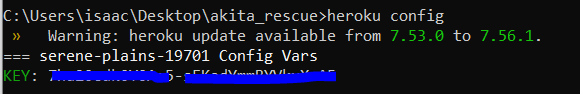

# 📜 Integrating Historical Transaction Data into your dApp

dApps on Ethereum have grown in complexity, depth, and breadth in the past few years. One missing piece is the efficient querying of historical block information. With standard Ethereum JSON-RPC methods, developers either need to maintain centralized databases containing large swaths of the blockchain history, or repeatedly query blocks across long time periods in order to scrap the entire transaction history of a particular address. These two options complicate the process in which users like wallet providers supply information such as the history of a particular user's interactions on the blockchain. Without easy access to this information, developers must rely on expensive, slow methods that limit the feature set of their apps.

While building historical queries into dApps has traditionally been complicated, time-consuming, and error-prone, the [Alchemy Transfers API](../apis/enhanced-apis/transfers-api.md) allows for developers to query historical wallet activity, token transfers, and other account-driven transactions in a simple transaction.  

In this tutorial, we’ll look at an example of how, with just a few lines of code, your dApp can integrate the power of the Alchemy Transfers API. 

## **Overview**

1. [High level walkthrough](transfers-tutorial.md#our-example) of the example project 
2. \*\*\*\*[**Option 1: Building the dApp using Heroku**](transfers-tutorial.md#option-1-building-the-dapp-using-heroku)\*\*\*\*
   1. Clone [Github Repo](https://github.com/pileofscraps/alchemy_notify.git) & Set Up Heroku
   2. Create a [free Alchemy account](https://alchemy.com/?r=affiliate:edc790e6-b0b0-41ce-9c6b-25959178d827)
   3. [Integrate Alchemy Transfers API](transfers-tutorial.md#3-integrate-alchemy-transfers-api)
   4. [Insert Alchemy API key](transfers-tutorial.md#4-insert-alchemy-api-key)
   5. [Deploy Heroku App!](transfers-tutorial.md#5-deploy-heroku-app)
3. \*\*\*\*[**Option 2: Building the dApp from scratch**](transfers-tutorial.md#build-the-dapp-from-scratch)\*\*\*\*
   1. Create a [free Alchemy account](https://alchemy.com/?r=affiliate:edc790e6-b0b0-41ce-9c6b-25959178d827)
   2. [Integrate Alchemy Transfers API](transfers-tutorial.md#3-integrate-alchemy-transfers-api)
   3. [Insert Alchemy API key](transfers-tutorial.md#4-insert-alchemy-api-key)
   4. [Create Backend Processing Script](transfers-tutorial.md#4-create-backend-processing-script)
   5. [Create dApp Dashboard Frontend](transfers-tutorial.md#5-create-dapp-dashboard-frontend)
   6. [Deploy!](transfers-tutorial.md#d-deploy)

## **Our Example**

For our pre-packaged example, we’ll create a dApp dashboard that tracks transaction activity for a particular address, processes it in the backend, and then pushes it in real-time to the frontend.  ****

### **Problem Statement:** 🐕

Instead of sending burnt tokens to 0xdead, which is recommended for most token burning, creators of Akita Inu \(AKITA\) and Shiba Inu \(SHIBA\) chose to gift Vitalik Buterin with large swaths of their dog-themed tokens. However, rather than leaving the meme tokens untouched, Vitalk instead chose to sell tokens in batches to Uniswap, swapping them for ETH, and donated both the ETH proceeds and the rest of the tokens that could not be sold to a whole host of charities. Check out [this article](https://www.theblockcrypto.com/post/104676/vitalik-buterin-donates-more-than-60m-to-charity-after-selling-meme-tokens-including-shiba-inu) for more info.

One of the lucky recipients of this windfall was the [Gitcoin](https://gitcoin.co/) community multisig account \(multisig stands for multi-signature, which is a specific type of digital signature that makes it possible for two or more users to sign in to access / control the funds in a single wallet address\). With the market valuation of the AKITA token transfer at ~$450 million, no single market would be able to absorb a single sale of the tokens, and if the multisig attempted to do so, the price of AKITA would plummet.  As such, the Gitcoin community decided to implement a token “rescue” process that would burn 13 AKITA tokens for every 1 AKITA sold off to the open market.   

Our example dashboard follows along with the story of AKITA and its rescue process by tracking the total number of AKITA tokens held in the Gitcoin multisig and the total number of tokens that have been burnt as part of the rescue contract.  

The dashboard that we create performs two functions.  Upon refresh of page or user click, the webapp fires off a request to Alchemy, querying the Gitcoin multisig address and the [“rescue” smart contract](https://etherscan.io/address/0x0B71C0E0F03e8546e682c0107f9c771D190A0F1e#code).  After receiving the response, the dashboard parses the JSON object and processes it.  Ultimately, the website frontend displays the processed items.

## Option 1: Building the dApp using Heroku

### 1. Set Up Github Repo & Heroku 

#### a\) Make a clone of the existing [Github Repository](https://github.com/pileofscraps/alchemy_notify.git)

Navigate to your command line and type:

```text
git clone https://github.com/alchemyplatform/Alchemy-Transfers-Tutorial

cd Alchemy-Transfers-Tutorial
```

#### b\) Install Heroku-CLI and verify/install dependencies

In this tutorial, we utilize Heroku for hosting a server and website; if you choose to use Heroku, be sure to follow all of the following steps. If you want to use another provider, see [Option 2: Build Project From Scratch](transfers-tutorial.md#option-2-build-the-dapp-from-scratch)

* Download [Heroku-CLI](https://devcenter.heroku.com/articles/heroku-cli#download-and-install) based on your OS.  Make sure you download the correct version based on what kind of computer environment you are using!


* After installation, navigate into the file that you just git cloned and run the following command in your command line to login to your Heroku account.

```text
heroku login
```

Follow the commands to login into your Heroku account. If you don't have a Heroku account, you can [sign up for one](https://www.heroku.com/) for free!   


* Let's confirm that you have downloaded the correct version of Node. In your command line run: 

```text
node --version
```

After running the command, you will either see a version number appear or you will instead get an error message telling you that you do not have Node installed.  


Note that Heroku requires users to have any version of Node greater than 10 installed. If you don’t have it or have an older version, [install a more recent version of Node](https://nodejs.org/en/download/). 

* Lastly, let's confirm that we also have npm installed properly. 

Again in your command line, run the following command:

```text
npm --version
```

npm is installed with Node, so check that it’s there. If you don’t have it, [install a more recent version of Node](https://nodejs.org/en/download/)**.**

#### c\) Initiate Heroku

Now that we have confirmed that Heroku has all the dependencies it needs to run, let's create our Heroku app by running the following command:

```text
heroku create
```

You should then see something like this pop up:


Make sure you take note of the URL that pops up **`http://xxxxxxxxx.herokuapp.com/`.** We'll be using it since it's the URL of our sample dashboard!


For more detailed instructions on setting up your environment to be configured for Heroku, check out the [official Heroku docs](https://devcenter.heroku.com/articles/getting-started-with-nodejs?singlepage=true).


### **2. Create a** [**Free Alchemy Account**](https://alchemy.com/?r=affiliate:edc790e6-b0b0-41ce-9c6b-25959178d827)\*\*\*\*

If you don’t already have one, you’ll first need to [create an account on Alchemy.](https://alchemy.com/?r=affiliate:edc790e6-b0b0-41ce-9c6b-25959178d827
) The free version will work fine for getting started!

### **3. Integrate Alchemy Transfers API** 

Once you have an account, you are now able to use the [`alchemy_getAssetTransfers`](../apis/enhanced-apis/transfers-api.md) method which allows you to query asset transfers.  

For our Akita Token Rescue dashboard, this is the specific request that we use:

```javascript
{
  "jsonrpc": "2.0",
  "id": 0,
  "method": "alchemy_getAssetTransfers",
  "params": [
      {
      "fromBlock": "0xC30965",
      "toBlock": "latest",
      "fromAddress": "0xde21F729137C5Af1b01d73aF1dC21eFfa2B8a0d6",
      "toAddress": "0xDead000000000000000000000000000000000d06",
      "contractAddresses": ["0x3301Ee63Fb29F863f2333Bd4466acb46CD8323E6"],
      "category": ["external","token"]
    }
  ]
}
```

* `fromBlock`: `0xC30965` is the block that the contract \(`0x3301Ee63Fb29F863f2333Bd4466acb46CD8323E6`\) was deployed in, we don't need to look in any earlier blocks because there would not be any activity
* `toBlock`: `latest` the most recent block, we want all transaction activity
* `fromAddress`: `0xde21F729137C5Af1b01d73aF1dC21eFfa2B8a0d6` is the Gitcoin multisig address
* `toAddress` : `0xDead000000000000000000000000000000000d06` is the address used for burning tokens 
* `contractAddresses` : `0x3301Ee63Fb29F863f2333Bd4466acb46CD8323E6` contract where the Akita rescue logic is stored 
* `category`: `["external","token"]` are the [types of transfer events](../apis/enhanced-apis/transfers-api.md#types-of-transfers) we want to monitor 

### 4. Insert Alchemy API Key

Navigate to the `main.py` to find where your API key is being used.  Note that to get an Alchemy API key you will need to [create an App](https://www.youtube.com/watch?v=tfggWxfG9o0) in the Alchemy dashboard.


**NOTE:** For this tutorial, we require using an app that is pointed towards the Ethereum mainnet since our contract is deployed on mainnet. 


Our Heroku app is configured to accept the Alcehmy API key as an environment variable to encourage safe, best practices.  Once you get your API key after creating an account, run the following command in the same file directory that you previously ran `heroku create` to set your environment variables within Heroku itself .

```text
heroku config:set KEY="<YOUR ALCHEMY KEY>"
```


**NOTE:** When you copy your key from the dashboard you should get a full url like this:

[`https://eth-mainnet.alchemyapi.io/v2/kXtBl52Cr0hNbOn0rI2up7lhUiGk_2eS`](https://eth-mainnet.alchemyapi.io/v2/kXtAc2qCG7HnbON0fI4ho3NHUiWj_2cS)\`\`

Your key is just the last portion in the URL: 

[`kXtBl52Cr0hNbOn0rI2up7lhUiGk_2eS`](https://eth-mainnet.alchemyapi.io/v2/kXtAc2qCG7HnbON0fI4ho3NHUiWj_2cS)\`\`


You've set up your API key!  To confirm that it is properly configured, you can view environment variables on Heroku with: `heroku config`

Your Heroku environment variables should look similar to this:



### **5. Deploy Heroku App!**

Now, we're in the final steps!  Confirm that you are navigated to the file that your Heroku project lives within. Once there, run the following commands to save your changes on Git and deploy the app. 

```text
git add .                             // to add changes
git commit -m "added Alchemy keys"    // to add a comment 
git push heroku master                // to push and deploy your heroku app
```

With that, we have pushed all changes to Heroku and are now able to view our dashboard live. Open the Heroku app at the URL that your project has been pushed to.  


Note that upon refreshing the page, we see that the dashboard's data is updated.  Likewise, if we click on the "Refresh Data" button, we find that the balances displayed also change if someone has interacted with the rescue contract.

And now, with everything in place, you can test out your dApp!  

_🎉 **Congratulations on your dApp deployment! Feel free to edit your app, point the target address at other interesting contracts / public figures, or make the frontend more spiffy!**_

## **Option 2: Build the dApp From Scratch**

In this tutorial, we provide a generalized setup for a Python webapp that allows you to query the Alchemy Transfers API, process the JSON response, and then push the data to the frontend.

### **1-2. Complete** [**Steps 2 & 3**](https://docs.alchemy.com/alchemy/tutorials/transfers-tutorial#2-create-a-free-alchemy-account) **from the Heroku Project.** 

### **3. Configure your App with your Alchemy API Key**

To follow safe, best practices, we encourage you to store your API key in an `.env` file. Taking the key that we generated from the previous step, create an `.env` file with the following contents:


HINT: You'll need to install the dotenv package if you haven't already. Follow [these steps](sending-txs.md#5-install-dotenv) to learn more. 


```text
KEY="<YOUR ALCHEMY KEY>"
```

Congrats! You've set up your API key!  

### **4. Create Backend Processing Script**

For this tutorial, we use Python / React for sending our API requests, decoding the JSON response, and for processing it. 

#### a\) Install necessary dependencies

Our tutorial is primarily built with Python and we use [Flask](https://flask.palletsprojects.com/en/2.0.x/) to power our app. Make sure that you have the follow dependencies in your environment to follow along. 

* One easy way to install the necessary dependencies is to create a file named `requirements.txt` with the following items inside of it.

```python
Click==7.0
Flask==1.1.1
flask-ldap3-login==0.9.16
Flask-Login==0.4.1
Flask-WTF==0.14.2
gunicorn==19.9.0
itsdangerous==1.1.0
Jinja2==2.10.1
ldap3==2.6.1
MarkupSafe==1.1.1
pyasn1==0.4.7
pyasn1-modules==0.2.6
requests==2.26.0
Werkzeug==0.16.0
WTForms==2.2.1
web3==5.20.0
```

Then, run the following command to install the packages: 

```text
pip install requirements.txt
```

**b\) Create a file called `main.py`**

This is where our backend processing script will live. We'll also add a few installations and define our Alchemy key variable at the top:

```python
from flask import Flask, jsonify, render_template, request
from forms import DataTriggerForm
import os
import json
from web3 import Web3
import requests

ALCHEMY_KEY = os.environ.get('KEY')
```

**c\) Define Web3 functions**

In our tutorial, we have a total of two different native Web3 calls. In particular, we call `get_block` and`balanceOf`.

To call `get_block` to get the current block number we use the add the following function to `main.py`:

```python
w3 = Web3(Web3.HTTPProvider('https://eth-mainnet.alchemyapi.io/v2/'+ALCHEMY_KEY))

def get_block_num():
    return str(w3.eth.get_block('latest')['number']) 
```

To call `balanceOf` to get the current balance of an ERC20 token, we need an additional piece of code on top of what we would normally call in Web3 to get the Ethereum balance of an address.  To do that we'll add the following function in `main.py`:

```python
w3 = Web3(Web3.HTTPProvider('https://eth-mainnet.alchemyapi.io/v2/'+ALCHEMY_KEY))

# includes the standard ERC20 ABI info
ERC20_ABI = json.loads('[{"constant":true,"inputs":[],"name":"name","outputs":[{"name":"","type":"string"}],"payable":false,"stateMutability":"view","type":"function"},{"constant":false,"inputs":[{"name":"_spender","type":"address"},{"name":"_value","type":"uint256"}],"name":"approve","outputs":[{"name":"","type":"bool"}],"payable":false,"stateMutability":"nonpayable","type":"function"},{"constant":true,"inputs":[],"name":"totalSupply","outputs":[{"name":"","type":"uint256"}],"payable":false,"stateMutability":"view","type":"function"},{"constant":false,"inputs":[{"name":"_from","type":"address"},{"name":"_to","type":"address"},{"name":"_value","type":"uint256"}],"name":"transferFrom","outputs":[{"name":"","type":"bool"}],"payable":false,"stateMutability":"nonpayable","type":"function"},{"constant":true,"inputs":[],"name":"decimals","outputs":[{"name":"","type":"uint8"}],"payable":false,"stateMutability":"view","type":"function"},{"constant":true,"inputs":[{"name":"_owner","type":"address"}],"name":"balanceOf","outputs":[{"name":"","type":"uint256"}],"payable":false,"stateMutability":"view","type":"function"},{"constant":true,"inputs":[],"name":"symbol","outputs":[{"name":"","type":"string"}],"payable":false,"stateMutability":"view","type":"function"},{"constant":false,"inputs":[{"name":"_to","type":"address"},{"name":"_value","type":"uint256"}],"name":"transfer","outputs":[{"name":"","type":"bool"}],"payable":false,"stateMutability":"nonpayable","type":"function"},{"constant":true,"inputs":[{"name":"_owner","type":"address"},{"name":"_spender","type":"address"}],"name":"allowance","outputs":[{"name":"","type":"uint256"}],"payable":false,"stateMutability":"view","type":"function"},{"anonymous":false,"inputs":[{"indexed":true,"name":"_from","type":"address"},{"indexed":true,"name":"_to","type":"address"},{"indexed":false,"name":"_value","type":"uint256"}],"name":"Transfer","type":"event"},{"anonymous":false,"inputs":[{"indexed":true,"name":"_owner","type":"address"},{"indexed":true,"name":"_spender","type":"address"},{"indexed":false,"name":"_value","type":"uint256"}],"name":"Approval","type":"event"}]')  # noqa: 501

akita = w3.eth.contract(address=AKITA_ADDRESS, abi=ERC20_ABI)

def get_gtc_akita_bal():
    return str(akita.functions.balanceOf(GITCOIN_ADDRESS).call())
```

Note that we include the ERC20 ABI in this code snippet in order to properly read the AKITA balance of the Gitcoin multisig wallet.The Contract Application Binary Interface \([**ABI**](../guides/eth_getlogs.md#what-are-ab-is)\) is the standard way to interact with contracts in the Ethereum ecosystem and we use the ERC20 ABI to interact with ERC20 contracts such as the AKITA contract.

**d\) Define Alchemy Transfer function**

Here, we use the Alchemy specific method [`alchemy_getAssetTransfers`](../apis/enhanced-apis/transfers-api.md#alchemy_getassettransfers) to get the total number of AKITA tokens burned by the Gitcoin contract.  

```python
def get_total_burn(): total_burn = requests.post('https://eth-mainnet.alchemyapi.io/v2/'+ALCHEMY_KEY, json={"jsonrpc": "2.0","id": 0,"method": "alchemy_getAssetTransfers","params": [{"fromBlock": "0xC30965","toBlock": "latest","fromAddress": "0xde21F729137C5Af1b01d73aF1dC21eFfa2B8a0d6","toAddress": "0xDead000000000000000000000000000000000d06","contractAddresses": ["0x3301Ee63Fb29F863f2333Bd4466acb46CD8323E6"],"category": ["external","token"]}]})

    json_response = total_burn.json()
    transfer_nums = len(json_response['result']['transfers'])
    
    burned = 0
    for i in range(transfer_nums):
        burned = burned + json_response['result']['transfers'][i]['value']
    return burned
```

To understand the parameter breakdown, read more [above](transfers-tutorial.md#3-integrate-alchemy-transfers-api).


**NOTE:** We parse our JSON response by using the imported Python package `json` to help us easily sort through the response and filter for the desired fields.  To get a better idea of what this response looks like raw, try the [Alchemy Composer App](https://composer.alchemyapi.io?composer_state=%7B%22chain%22%3A0%2C%22network%22%3A0%2C%22methodName%22%3A%22eth_getBlockByNumber%22%2C%22paramValues%22%3A%5B%22latest%22%2Cfalse%5D%7D) or try executing an Alchemy API call from Postman.  


**e\) Configure Flask routing**

To ensure that "Refresh Data" command from the frontend button triggers the execution of the 3 functions defined above, we need to configure our flask to handle this logic! Add the following to your `main.py` file:

```python
app = Flask(__name__)
SECRET_KEY = os.urandom(32)
app.config['SECRET_KEY'] = SECRET_KEY

@app.route('/', methods=['GET', 'POST'])
def refresh():
    #num1 = None
    block_num = get_block_num()
    balance = get_gtc_akita_bal()
    total_burn = get_total_burn()

    form = DataTriggerForm()

    if request.method == 'POST':
        #num1 = form.num1.data
        block_num = get_block_num()
        balance = get_gtc_akita_bal()
        total_burn = get_total_burn()

    return render_template('index.html', form=form, bal=balance, block_num=block_num, total_burn=total_burn)

```

Whenever the "Refresh Data" button is triggered, we fire off a request to the Alchemy API which in turn gives us our updated data.  Note that lines 7-10 and 14-18 are duplicated to ensure that our website refreshes its data whenever we first load in as we visit it, whenever someone refreshes the site, or when a user clicks the "Refresh Data" button.  

Once we are able to get the most updated values from each of the 3 functions, we can then pass this data into our`render_template` function which pushes the new information to the frontend.

**Our script is ready!** Here is the entire sample `main.py` we have created together:

```python
from flask import Flask, jsonify, render_template, request
from forms import DataTriggerForm
import os
import json
from web3 import Web3
import requests

ALCHEMY_KEY = os.environ.get('KEY')
w3 = Web3(Web3.HTTPProvider('https://eth-mainnet.alchemyapi.io/v2/'+ALCHEMY_KEY))

# includes the standard ERC20 ABI info
ERC20_ABI = json.loads('[{"constant":true,"inputs":[],"name":"name","outputs":[{"name":"","type":"string"}],"payable":false,"stateMutability":"view","type":"function"},{"constant":false,"inputs":[{"name":"_spender","type":"address"},{"name":"_value","type":"uint256"}],"name":"approve","outputs":[{"name":"","type":"bool"}],"payable":false,"stateMutability":"nonpayable","type":"function"},{"constant":true,"inputs":[],"name":"totalSupply","outputs":[{"name":"","type":"uint256"}],"payable":false,"stateMutability":"view","type":"function"},{"constant":false,"inputs":[{"name":"_from","type":"address"},{"name":"_to","type":"address"},{"name":"_value","type":"uint256"}],"name":"transferFrom","outputs":[{"name":"","type":"bool"}],"payable":false,"stateMutability":"nonpayable","type":"function"},{"constant":true,"inputs":[],"name":"decimals","outputs":[{"name":"","type":"uint8"}],"payable":false,"stateMutability":"view","type":"function"},{"constant":true,"inputs":[{"name":"_owner","type":"address"}],"name":"balanceOf","outputs":[{"name":"","type":"uint256"}],"payable":false,"stateMutability":"view","type":"function"},{"constant":true,"inputs":[],"name":"symbol","outputs":[{"name":"","type":"string"}],"payable":false,"stateMutability":"view","type":"function"},{"constant":false,"inputs":[{"name":"_to","type":"address"},{"name":"_value","type":"uint256"}],"name":"transfer","outputs":[{"name":"","type":"bool"}],"payable":false,"stateMutability":"nonpayable","type":"function"},{"constant":true,"inputs":[{"name":"_owner","type":"address"},{"name":"_spender","type":"address"}],"name":"allowance","outputs":[{"name":"","type":"uint256"}],"payable":false,"stateMutability":"view","type":"function"},{"anonymous":false,"inputs":[{"indexed":true,"name":"_from","type":"address"},{"indexed":true,"name":"_to","type":"address"},{"indexed":false,"name":"_value","type":"uint256"}],"name":"Transfer","type":"event"},{"anonymous":false,"inputs":[{"indexed":true,"name":"_owner","type":"address"},{"indexed":true,"name":"_spender","type":"address"},{"indexed":false,"name":"_value","type":"uint256"}],"name":"Approval","type":"event"}]')  # noqa: 501

# configures web3 to point towards the AKITA token address
AKITA_ADDRESS = '0x3301Ee63Fb29F863f2333Bd4466acb46CD8323E6'
GITCOIN_ADDRESS = '0xde21F729137C5Af1b01d73aF1dC21eFfa2B8a0d6'
akita = w3.eth.contract(address=AKITA_ADDRESS, abi=ERC20_ABI)

app = Flask(__name__)
SECRET_KEY = os.urandom(32)
app.config['SECRET_KEY'] = SECRET_KEY


def get_block_num():
    return str(w3.eth.get_block('latest')['number'])

def get_gtc_akita_bal():
    return str(akita.functions.balanceOf(GITCOIN_ADDRESS).call())

def get_total_burn():
    total_burn = requests.post('https://eth-mainnet.alchemyapi.io/v2/'+ALCHEMY_KEY, json={"jsonrpc": "2.0","id": 0,"method": "alchemy_getAssetTransfers","params": [{"fromBlock": "0xC30965","toBlock": "latest","fromAddress": "0xde21F729137C5Af1b01d73aF1dC21eFfa2B8a0d6","toAddress": "0xDead000000000000000000000000000000000d06","contractAddresses": ["0x3301Ee63Fb29F863f2333Bd4466acb46CD8323E6"],"category": ["external","token"]}]})

    json_response = total_burn.json()
    transfer_nums = len(json_response['result']['transfers'])

    burned = 0
    for i in range(transfer_nums):
        burned = burned + json_response['result']['transfers'][i]['value']
    return burned

@app.route('/', methods=['GET', 'POST'])
def refresh():
    #num1 = None
    block_num = get_block_num()
    balance = get_gtc_akita_bal()
    total_burn = get_total_burn()

    form = DataTriggerForm()

    if request.method == 'POST':
        #num1 = form.num1.data
        block_num = get_block_num()
        balance = get_gtc_akita_bal()
        total_burn = get_total_burn()

    return render_template('index.html', form=form, bal=balance, block_num=block_num, total_burn=total_burn)


if __name__ == '__main__':
    app.run(debug=True, host='0.0.0.0')

```


Note that one of the import statements in our previous Python file refers to _DataTriggerForm_ in a file named`forms.py` This piece of code effects the text that appears on our frontend button and contains a default form from Flask.    
  
Include below is the code for _DataTriggerForm_ which lives in our`forms.py` file.


```python
from flask_wtf import FlaskForm
from wtforms import SubmitField, IntegerField


class DataTriggerForm(FlaskForm):
    submit = SubmitField('Refresh Data!')
```

### 5. Create dApp Dashboard Frontend

With our Python script ready, we’ll now build our dashboard. Our example client is extremely simple. Of course, you’ll want to integrate this code into your dApp as appropriate with a different target address and different graphics!

Our dashboard is a simple HTML page that displays any information that was processed by the Python scripts in the background.

#### a\) Create your `index.html` **file**

This is the file where we will store all of our frontend code.

#### b\) Create "Refresh Data" Button

```markup
<form action="/" method="post">
    <div class="form-group">
        {{ form.submit }}
    </div>
</form>
```

This piece of code "POSTS" a trigger to the Python script, we created previously.  This lets us know when the user has click the "Refresh Data" button and executes the Python code.

#### c\) Create UI Elements that our Python Script Can Push Data To

```markup

<p>Block Number: {{ block_num }}</p>



<p>Gitcoin Akita Balance: {{ bal }}</p>



<p>Akita Rescued: {{ total_burn }}</p>

```

This piece of code gathers variables that was previously passed into our `render_template` function.  Retrieving the variables, we can update the frontend as soon as we have parsed and received new data from the Alchemy API.  

#### d\) Add Other HTML Elements 

This is only a small number of HTML elements that we can add to frontend of our dashboard.  Feel free to change up the UI that we included below; here's the sample `index.html` file that we just built together \(with some liberty taken for graphics / UI\)

```markup
<!DOCTYPE html>

<!DOCTYPE html>
<html>
<title>Akita Rescue</title>
<meta charset="UTF-8">
<meta name="viewport" content="width=device-width, initial-scale=1">
<link rel="stylesheet" href="https://www.w3schools.com/w3css/4/w3.css">
<link rel="stylesheet" href="https://fonts.googleapis.com/css?family=Raleway">
<style>
body,h1 {font-family: "Raleway", sans-serif}
body, html {height: 100%}
.bgimg {
  background-image: url('https://static.slab.com/prod/uploads/7adb25ff/posts/images/jsZSd8xIzicYLd9fj6XulBjZ.png');
  min-height: 100%;
  background-position: center;
  background-size: cover;
}
</style>
<body>

  <!-- Header -->
  <header class="w3-container w3-center w3-padding-32">
    <h1><b>Akita 🐕 Rescue 🛠</b></h1>
  </header>


<div class="bgimg w3-display-container w3-animate-opacity w3-text-black">
  <div class="w3-display-center w3-padding-large w3-large">
      A dashboard that tracks the "rescue" of the AKITA tokens in the Gitcoin multi-sig.  For every purchase of 1 AKITA, 13 are burnt from Gitcoin.
ETH from the sale lands back in the Gitcoin multi-sig and will be used for the ETH side of an ETH/AKITA LBP.
  </div>

  <div>
  </div>

  <div class="w3-display-bottomright w3-padding-large">
    For more info about Vitalik's donation of AKITA tokens to Gitcoin, check out this <a href="https://gitcoin.co/blog/announcement-gitcoin-community-receives-generous-gift-from-vitalik-buterin/" target="_blank"> blog post.</a>
  </div>

  <div class="w3-display-middle">
    <hr class="w3-border-grey" style="margin:auto;width:40%">
    <p class="w3-large w3-center">Gitcoin AKITA Rescue Statistics</p>
    <div class="container form">
        <hr>
        <br>
        <form action="/" method="post">
            <div class="form-group">
                {{ form.submit }}
            </div>
        </form>
        
        <p>Block Number: {{ block_num }}</p>
        

        
        <p>Gitcoin Akita Balance: {{ bal }}</p>
        

        
        <p>Akita Rescued: {{ total_burn }}</p>
        
    </div>
  </div>
  <div class="w3-display-bottomleft w3-padding-large">
    Powered by <a href="https://www.alchemy.com/" target="_blank"> https://www.alchemy.com/</a>
  </div>
</div>

```

#### e\) Deploy!

After deploying this webapp in your desired environment, it should look like the following!


This is a simple example, but there are many ways you can expand on this to build dashboards and dApp for your users.  

Fork 🍴, build 🏗️, and design 📝off this repo!

## **Conclusion**

Blockchain has evolved quickly, but not all developer features are easy or intuitive to use.  In particular, the querying of historical transaction information is something that has plagued development.  However, with the Alchemy Transfers API, your users can stay informed and confident about understanding their transaction activity both in the present and the past!

**Ready to start using Alchemy Transfers?** [**Create a free Alchemy account**](https://alchemy.com/?r=affiliate:ba2189be-b27d-4ce9-9d52-78ce131fdc2d) **and get started today!**

